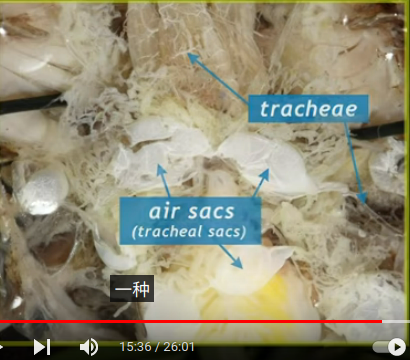
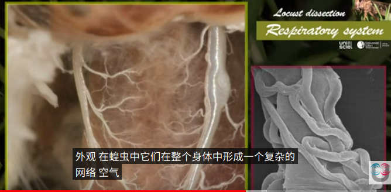
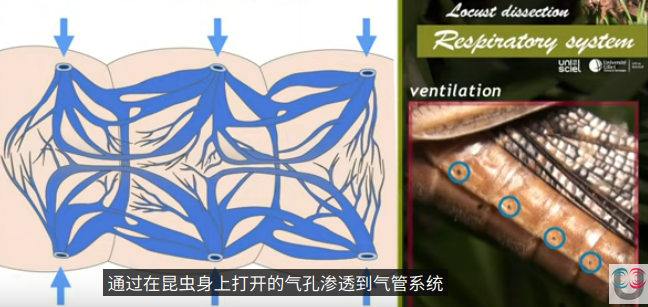
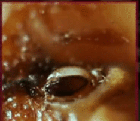
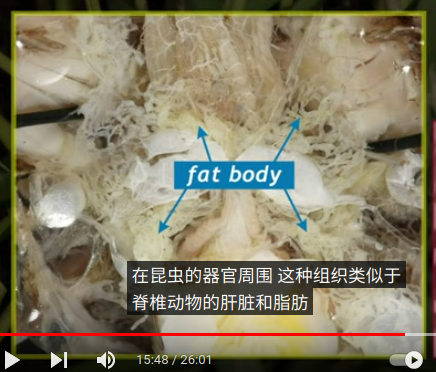
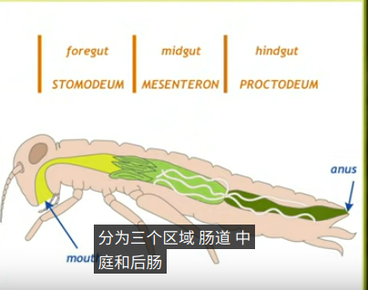

# 蝗总科

蝗虫，俗称蚱蜢、草蜢、蚂蚱。通常栖息于地面，它们的后腿强壮有力，使它们能够通过大力跳跃来逃避威胁。

蝗虫包含了蚱总科、蜢总科和蝗总科等昆虫。更特别地，“蝗虫”可以特指以飞蝗为代表的剑角蝗科中具有群行阶段的各种短角群居型蝗虫，它们是造成农业生产中蝗灾的罪魁祸首

【蝗虫解剖】

昆蟲的呼吸系統由氣管 (trachea)、小氣管 (tracheole)、氣門 (spiracle) 還有氣囊 (air sacs) 所組成。气囊是膜状的，构成空气储备。

空氣從氣門進去後，透過氣管不斷分支，最後傳到小氣管，其分支末梢就散佈在體細胞間，而氧氣跟二氧化碳就能透過擴散作用達到氣體交換。昆虫通过腹部规律地收缩，打开和关闭气门来调节呼吸。

脂肪体。

消化系统

参考:
- [蝗虫-wiki](https://zh.wikipedia.org/zh-hans/%E8%9D%97%E8%9F%B2)
- [蝗虫解剖Locust dissection-youtube](https://www.youtube.com/watch?v=tRu7DUu1ebo)