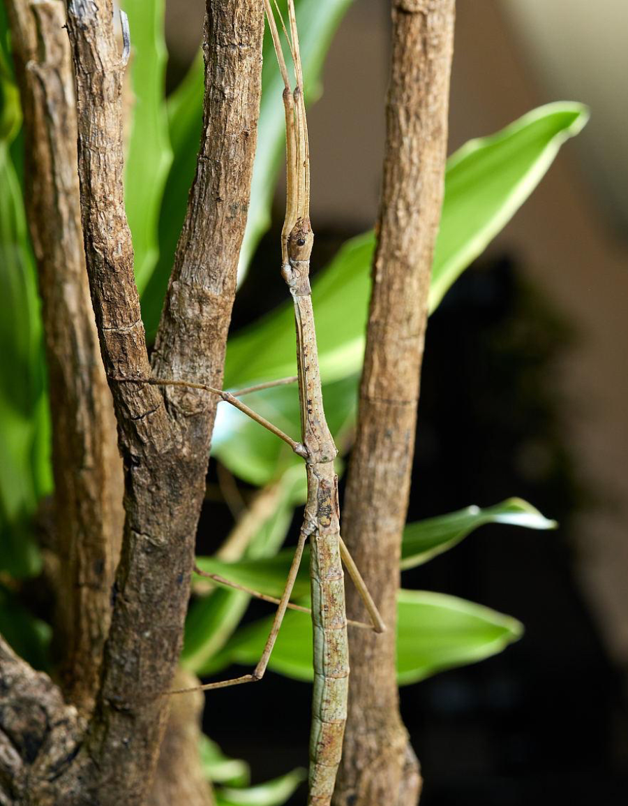

# 竹节虫目

|属性|说明|
| ---- | ---- |
| 别称| 杆䗛、叶䗛|
| 英文名|stick insects， walking sticks， leaf insects, Phasmatodea(这个词来自希腊文phasma，意思是“幽灵”或“鬼魂”)|
| 习性| 一般会以断肢、假死的方式欺敌|

【拟态】竹节虫的身体呈棒状、枝状或叶状，通常模拟树枝或树叶的形态，拟态现象显著，被称为昆虫界的“伪装大师”。杆䗛极似树木的细枝，足尤为细长，像树枝一样，趴在植物上时，将足向后舒展开来。而叶䗛极似树木的叶片，它们在树叶间停息或者悬挂着，完全消失在“其他”树叶之间。叶䗛的一些物种在生命的不同阶段会改变颜色，使它们能在每个阶段都能更好地融入寄主植物的颜色，甚至还会模仿树叶褪色或死亡枯萎的颜色。还有些竹节虫则完美地模仿了某些苔藓，斑驳得如地衣一般，这一切都取决于它们特殊的栖息地 。几乎所有的竹节虫都会轻轻地左右晃动身体，试图模仿微风吹动树枝的样子，从而加强它们的伪装。

参考:
- [竹节虫-百度百科](https://baike.baidu.com/item/%E7%AB%B9%E8%8A%82%E8%99%AB/23909)
- [竹节虫-嘎嘎昆蟲網](http://gaga.biodiv.tw/9404bx/A000%20-S541.htm)