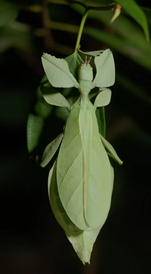

# 叶䗛[xiū]

|属性|说明|
| ---- | ---- |
| 别称| 叶虫|
| 英文名||
| 属||
| 分布||
| 寿命||
| 外形特征||
| 食性||
| 习性| 白天，它一动不动，只有在晚上，这种热带昆虫才敢在森林里爬行。|
| 繁殖||

参考:
- [叶䗛-百度百科](https://baike.baidu.com/item/%E5%8F%B6%E4%97%9B/20309283)
