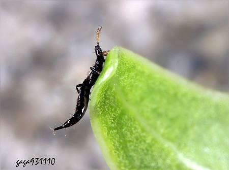
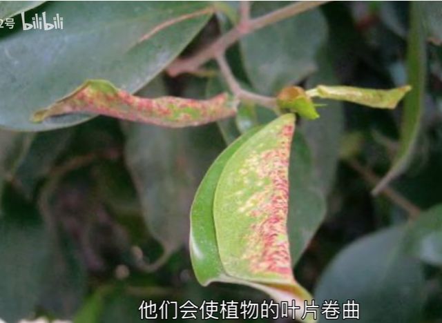

# 榕管蓟马

|属性|说明|
| ---- | ---- |
| 别称||
| 属||
| 分布||
| 寿命||
| 外形特征||
| 食性||
| 习性||
| 繁殖||

寄主为榕树、气达榕、杜鹃、无花果、龙船花等。

可以使得榕树叶片卷曲。

参考:
- [榕管蓟马-萝王2号-bilibili](https://www.bilibili.com/video/BV1NR4y1N7iy/?spm_id_from=333.337.top_right_bar_window_history.content.click&vd_source=741bff59809f9e15c309ef97c7d7c960)
