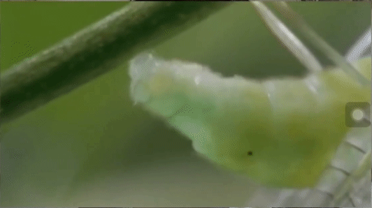
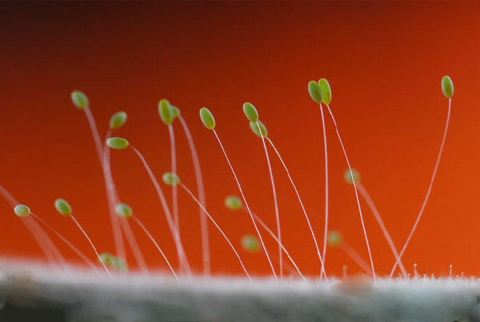

# 草蛉科

成年雌性草蛉的产卵过程，找一个没有人打扰的地方开始产卵，腹部开始收缩，然后往下一按，分泌出一些粘稠的胶状物质粘在植物上，然后腹部抬高，跟拔丝山药一样，一拉就拉出了一根小细丝，然后趁它还没干，在末尾产个卵正好就粘上了，举着等几秒，等它干，诶，一下子卵就脱开屁股了，这一个卵就产好了，往前走几步再去产下一个。

很多草蛉会一下产一排或一圈的卵。

人们认为这个拔丝产卵的方式是为了躲避天敌，把卵产到天上去，叶片上只留一个晶莹剔透的丝儿。

草蛉的幼虫，也叫蚜狮，破壳而出后，休息一会后，就会抱着那根卵柄爬。

参考: [bilibili-梦失焦的石榴](https://www.bilibili.com/video/BV1io4y1S7RE/?spm_id_from=333.337.search-card.all.click&vd_source=741bff59809f9e15c309ef97c7d7c960)