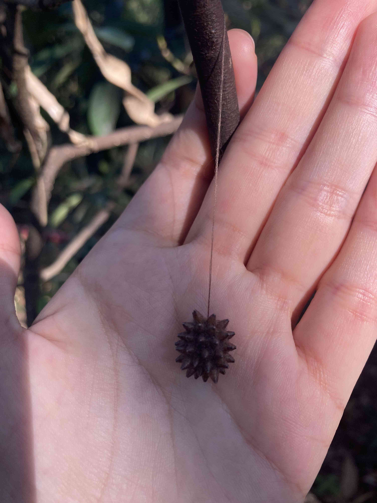
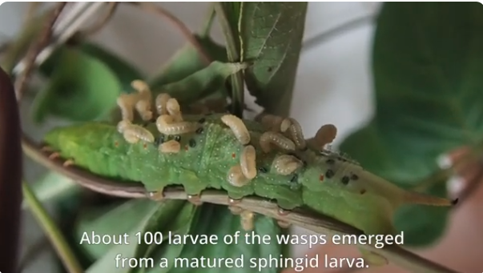
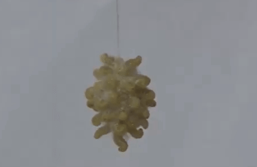
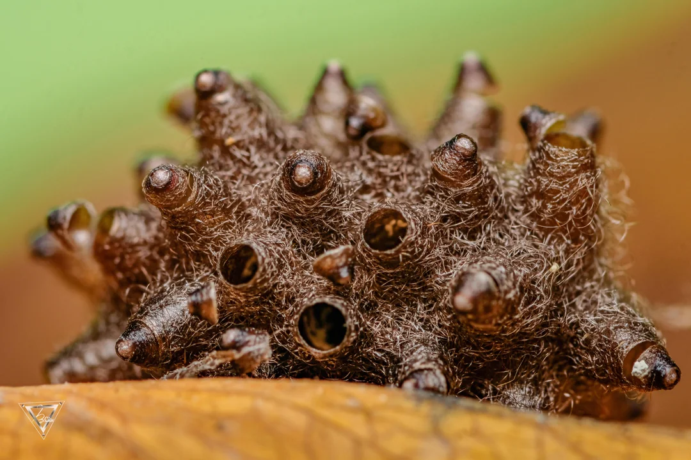

# 悬茧蜂

|属性|说明|
| ---- | ---- |
| 别称||
| 英文名||
| 属||
| 分布||
| 寿命||
| 外形特征| 雌蜂腹部末端具明显的产卵器，长度可达腹长的三分之二|
| 食性||
| 习性||
| 繁殖||

【寄生】寄生方式属于内寄生蜂，雌蜂将卵产在寄主幼虫体内，幼虫孵化后在寄主体内取食发育

寄主范围：主要寄生于鳞翅目（蝴蝶、蛾类）幼虫，包括稻螟蛉、粘虫、棉铃虫、斜纹夜蛾、舞毒蛾等农业害虫。少数种类也寄生鞘翅目（甲虫）幼虫。

寄生策略：
- 单寄生：一个寄主体内只发育一头寄生蜂——这是多数悬茧蜂的种类
- 多寄生：少数热带种类为群居寄生蜂，一个寄主体内可同时发育多头幼虫

结茧行为：幼虫老熟后从寄主体内钻出，先吐丝粘附于叶片，再引丝下垂，悬空吐丝结茧。茧的一端有长丝索悬挂，风吹时可摇晃。

悬茧蜂的集体茧

上图拍摄于深圳

结茧的过程

破茧

参考:
- [悬茧姬蜂的茧块形成](https://www.youtube.com/watch?v=AuHarLHolPM)
- [Meteorus stellatus cocoon](https://www.reddit.com/r/macrophotography/comments/1orrv18/meteorus_stellatus_cocoon/)
- [懸繭蜂的繭團](http://gagaphoto.com/new23/9005/s87.htm)
