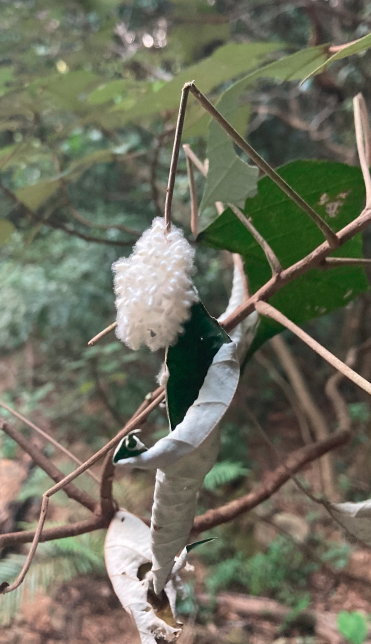
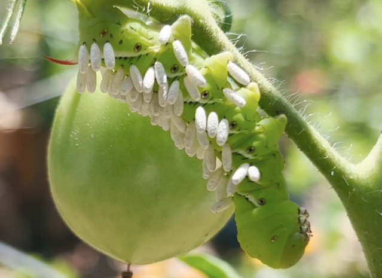
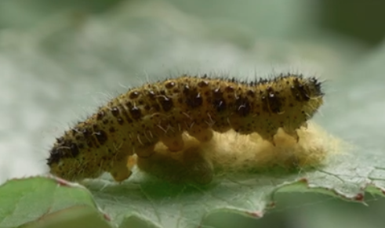

# 绒茧蜂

|属性|说明|
| ---- | ---- |
| 别称||
| 英文名||
| 属||
| 分布||
| 寿命||
| 外形特征||
| 食性||
| 习性||
| 繁殖| 寄生|

参考:
- [绒茧蜂-路无边616-bilibili](https://www.bilibili.com/video/BV1L6B9BuEGM/?share_source=copy_web&vd_source=fcf7bbddc2ffd7f073481728ff8f0f3c)
- [Cotesia Glomerata - youtube](https://www.youtube.com/watch?v=_9G1PND0vWA&t=9s)