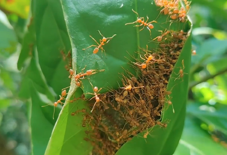
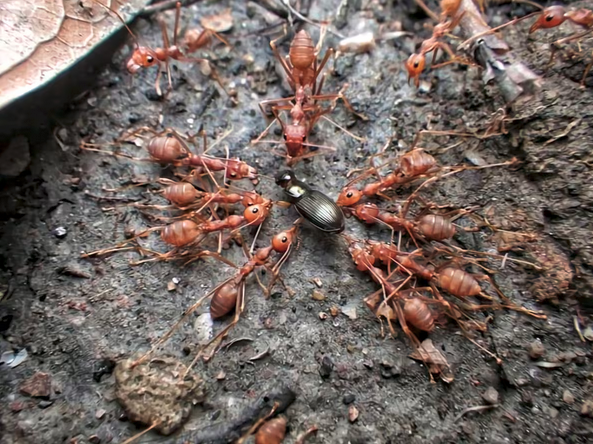
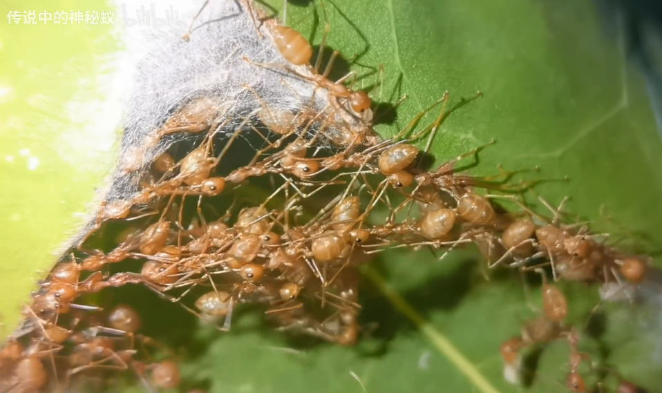
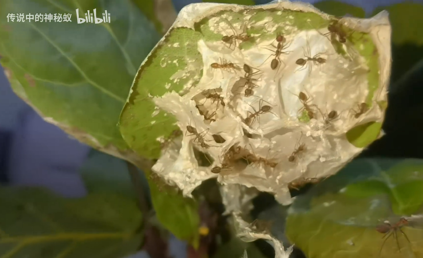
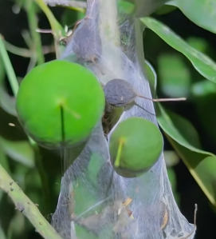

# 黄猄[jīng]蚁

|属性|说明|
| ---- | ---- |
| 别称| 酸蚂蚁|
| 英文名| Oecophylla smaragdina Fabricius|
| 属||
| 分布||
| 寿命||
| 外形特征||
| 食性||
| 习性| 喜温、好湿、不耐寒|
| 繁殖||

【捕食】黄琼蚁的捕猎方式类似于古代的车裂，就是我们平时说的五马分尸。工蚁会将猎物包围，分别咬住猎物的触须、尾部、腿部和身体凸出部分，分别向后拉扯。

【蚁巢】黄琼蚁聚集在叶片的顶部，通过自身的重量把叶片压弯压出凹槽（像是封顶?）。以及通过互相首位相连拉近两片叶片，再由工蚁钳着幼虫吐丝缝合叶片，构造出一个腔室作为巢穴。成虫的脚上不仅有钩子还有吸盘，可以牢牢地抓住比它重几十倍的东西而不脱落。

搭建蚁桥固定叶片。

！

内部结构。用丝线制成的隔断层。

【放牧】嫩叶上或者果实上的巢，可以把这一片地给圈起来，在里面安全地放牧蚜虫。

【可食用】做蚂蚁醋或者炒蚂蚁蛋。

参考:
- [黄猄蚁捕猎-传说中的神秘蚁-bilibili](https://www.bilibili.com/video/BV16G411F7G2/?share_source=copy_web&vd_source=fcf7bbddc2ffd7f073481728ff8f0f3c)
- [移巢筑巢-传说中的神秘蚁-bilibili](https://www.bilibili.com/video/BV1uTChYQEdF/?share_source=copy_web&vd_source=fcf7bbddc2ffd7f073481728ff8f0f3c)
- [黄猄蚁为何频频跟换巢室-传说中的神秘蚁-bilibili](https://www.bilibili.com/video/BV1db421b735/?share_source=copy_web&vd_source=fcf7bbddc2ffd7f073481728ff8f0f3c)
- [童工狂魔黄猄蚁-月下Van-bilibili](https://www.bilibili.com/video/BV17CZzYFES7/?share_source=copy_web&vd_source=fcf7bbddc2ffd7f073481728ff8f0f3c)
- [树冠层的建筑师—黄猄蚁饲养员-bilibili](https://www.bilibili.com/opus/1013772381072654361)