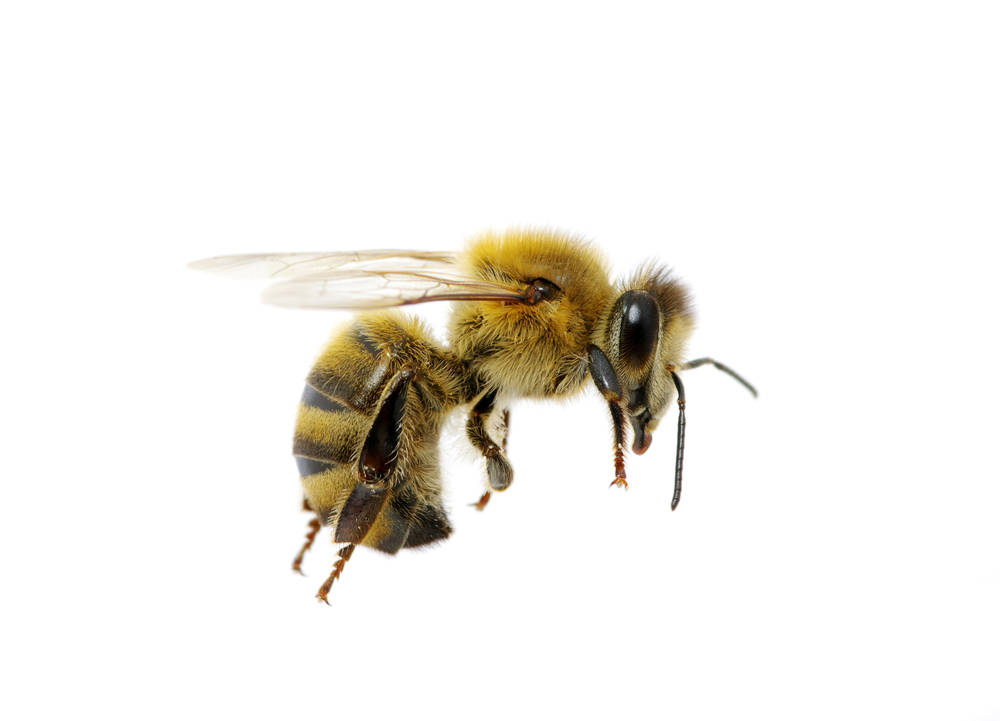
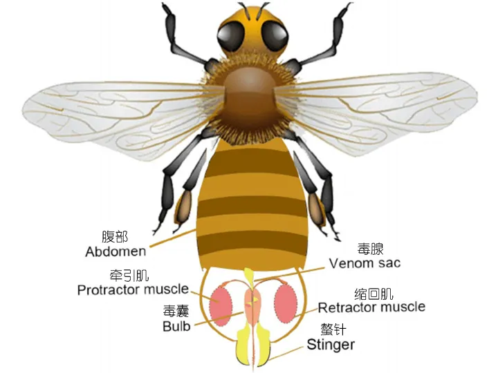
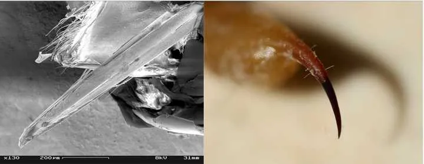

# 蜜蜂

|属性|说明|
| ---- | ---- |
| 别称||
| 属||
| 分布||
| 寿命||
| 外形特征||
| 食性||
| 习性||
| 繁殖||

蜜蜂的蛰[shì]针(由产卵器进化而来)带着倒刺，连着毒囊和内脏。当蜜蜂攻击身体柔软厚实的哺乳动物时，因为螫针上的倒刺结构，导致刺入容易拔出难，常常和攻击对象同归于尽。而蜜蜂攻击其他昆虫时，昆虫身体有外骨骼保护，蛰针很难刺入昆虫体内，唯一的软肋就是昆虫腹部体节之间是靠一层弹性的膜连接的，称为节间膜，一旦被蜜蜂刺入节间膜并注入毒液，入侵昆虫就死定了，为了提高成功率，蜜蜂进化出了蛰针上的倒刺结构，更方便刺入。

即使[螫针已经和蜜蜂腹部脱离](https://youtu.be/7_wr3DIqzr0)，但与其相连的神经节还是会控制肌肉继续钻入螫针，并释放毒素。

除了蜜蜂外，还有一些会使用螫针攻击入侵者的生物，例如黄蜂、火蚁、穴居狼蛛、蝎子等。很过昆虫的螫针是可以重复利用的。下图中小黄蜂（yellow jacket）的螫针顶部具有很小的倒刺，从而可以像电锯一样轻易的反复刺伤入侵者的表皮；蝎子火蚁等，螫针则非常光滑，顶端异常尖锐，可以频繁攻击敌人。

参考:
- [蜜蜂为什么采用自杀式攻击-知乎](https://www.zhihu.com/question/435032229/answer/1637976436)
