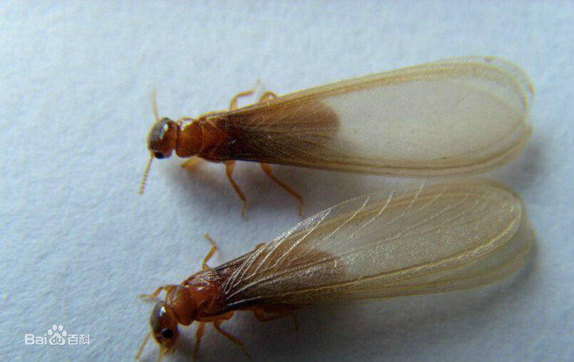

# 大水蚁

|属性|说明|
| ---- | ---- |
| 别称| 黄翅大白蚁|
| 属||
| 分布||
| 寿命||
| 外形特征||
| 食性||
| 习性||
| 繁殖| 每年4-6月，多在闷热或大雨前后的傍晚出巢婚飞。|

婚飞时，工蚁会在巢壁上挖掘出大量小孔，也就是婚飞口，对大型巢穴来说，数十万乃至上百万的长翅成虫会在短短数分钟内飞离巢穴，场面非常壮观。。等长翅成虫都飞离后，工蚁便会迅速将婚飞口修补和堵塞。

在落地前这些飞蚁具有趋光性，落地后，它们会主动脱去翅膀寻找伴侣(它们的翅膀就是非常容易脱落的)。落地后的白蚁就走上了脱单的艰难旅程。一旦找到异性，就会上演雌雄追尾的大戏，但此时它们并不会交配，而是组队寻找合适的筑巢地点，有水源有食物温度合适的地方，筑巢之后才会开始交配产卵。

参考:
- [雨后袭来的巨量飞蚁-SME情报员-zhihu](https://zhuanlan.zhihu.com/p/140540075)
