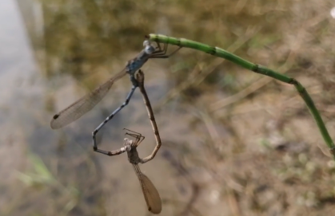
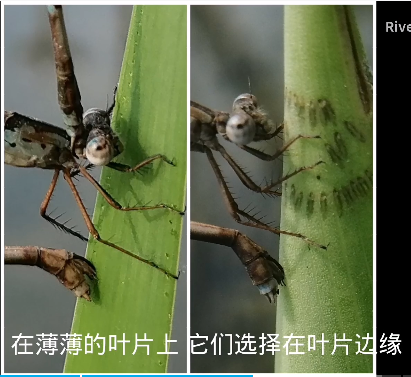

# 奇印丝蟌

雌性豆娘都拥有一个刀片状的产卵器，可以划破植物的表皮，将卵置入其中。

参考: [bilibili-River-河花](https://www.bilibili.com/video/BV1kZ4y1z7JY/?spm_id_from=333.788.recommend_more_video.0&vd_source=741bff59809f9e15c309ef97c7d7c960)
