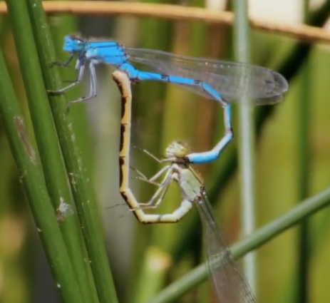

# 蟌[cōng]科

雄虫用尾部的肛附器抓握住雌虫的前胸，它用力举起雌虫，让雌虫把生殖器紧紧地贴合在自己的腹部第二节上(次生殖器，有着储物袋的功能，在交配时，会注满主生殖器产生的精液)，雌雄首尾相连，形成一个闭环。

雄性的阴茎有两个钩形物的探头，它可以舀出雌性先前和别的雄性注入的精子，从而确保它会成为雌性孩子的父亲。接着，雄性要马上让雌性产卵，以防出现另一只雄蟌，掏出它的精子。

参考: [蜻蜓与蟌 Dragons and Damsels](https://www.bilibili.com/video/BV15p4y1s7DE/?spm_id_from=333.337.search-card.all.click&vd_source=741bff59809f9e15c309ef97c7d7c960)
