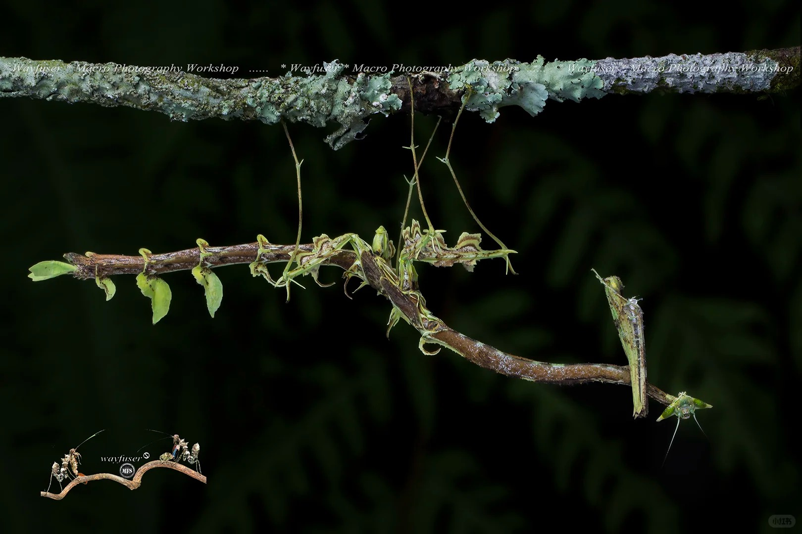

# 贝尔箭螳

|属性|说明|
| ---- | ---- |
| 别称||
| 英文名| Toxodera beieri|
| 属||
| 分布||
| 寿命||
| 外形特征||
| 食性||
| 习性||
| 繁殖||

参考:
- [Pangway - 小红书](https://www.xiaohongshu.com/discovery/item/683b2d38000000002101a947?source=webshare&xhsshare=pc_web&xsec_token=AB3fCy-7Su_xQbNyAxQ3WV2oXTR8UzCy2JzzIfni1Ro_U=&xsec_source=pc_share)
