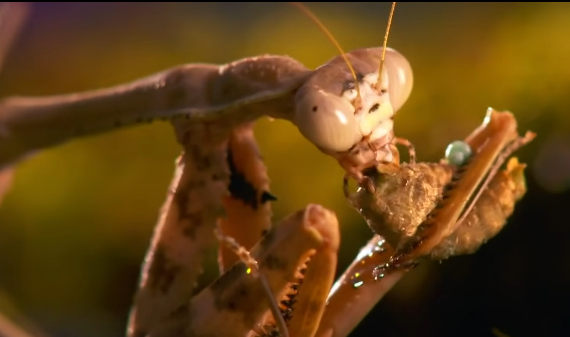
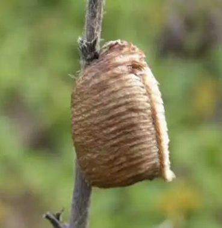

# 螳螂目

【双刀】螳螂的双刀是以个控制工具，叫做捕捉足。猎物不是被双刀给夹死的，而是靠着樱桃小嘴啃死对方。

【视觉】当你凝视螳螂的时候，螳螂也在凝视着你。昆虫的眼睛有多个晶状体(lens)，每一个晶体形成的视觉单元叫做小眼(ommatidium, ommatidia)，每一个小眼向大脑输送一个像素(pixel)。光进入小眼的角膜(cornea)后，被假视锥细胞(pseudocone)聚焦(focus)到图像感受器(receptor)细胞上。色素细胞(pigment cell)确保每个小眼只能看到正面的图像的一部分，因此，只有正面的小眼接收了入射光线(incident light)，而其他小眼把光线反射出去了，接收了入射光线的部位看起来就是黑色的。这个黑色的小点就叫做假瞳孔(pseudopupil)。

【繁殖】雌螳螂产卵不是一颗一颗的，还会排出像发泡胶一样的粘液，粘液干燥以后就会形成一个硬壳，叫做卵鞘。卵鞘内各有一个小隔间用来卵。

参考:
- [螳螂目—龙女之声-bilibili](https://www.bilibili.com/video/BV1sB4y1Q7bj/?share_source=copy_web&vd_source=fcf7bbddc2ffd7f073481728ff8f0f3c)
- [复眼-春暖花开奇奇乐乐-zhihu](https://www.zhihu.com/question/28629133/answer/103105044)