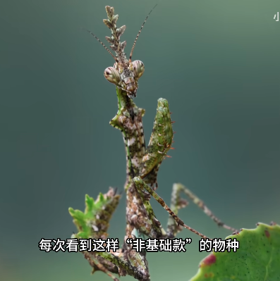

# 角胸屏顶螳

|属性|说明|
| ---- | ---- |
| 别称||
| 英文名||
| 属||
| 分布| 武夷山。高海拔，常年湿润。|
| 寿命||
| 外形特征||
| 食性||
| 习性| 喜欢栖息在附生着茂密苔藓的大树上|
| 繁殖||

参考:
- [小阳的昆虫世界-bilibili](https://www.bilibili.com/video/BV1jPpLzLEpg/?share_source=copy_web&vd_source=fcf7bbddc2ffd7f073481728ff8f0f3c)
