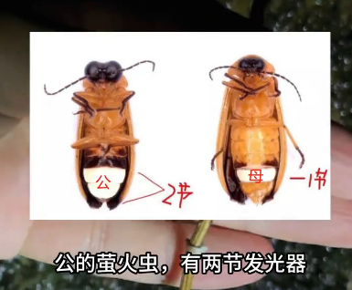

# 萤火虫

|属性|说明|
| ---- | ---- |
| 别称||
| 属||
| 分布||
| 寿命||
| 外形特征||
| 食性| 水栖萤火虫的幼虫吃螺类，贝类和水中的小动物，而陆栖的萤火虫幼虫则以蜗牛、蛞蝓为食物，有些种类会捕食蚯蚓和昆虫等小动物。|
| 习性||
| 繁殖||

【发光机制】

萤火虫的卵，幼虫和蛹都会发光，大部分成虫都是发光的，只有极少数成虫不会发光。

萤火虫发光的效率非常高，几乎能将化学能全部转化为可见光，为现代电光源效率的几倍到几十倍。由于光源来自体内的化学物质，因此，萤火虫发出来的光虽亮但没有热量，人们称这种光为“冷光”。

萤火虫的发光器是由发光细胞、反射层细胞、神经与表皮等所组成。如果将发光器的构造比喻成汽车的车灯，发光细胞就如车灯的灯泡，而反射层细胞就如车灯的灯罩，会将发光细胞所发出的光集中反射出去.

发光器从外表看只是一层银灰色的透明薄膜，这层薄膜中含有大量的荧光色素，薄膜内是数以千计的发光细胞，周围密布着小气管和纤细神经分支，再下面是反光层。发光细胞中的主要物质是荧光素和荧光素酶。当氧气通过小气管进入发光细胞时，荧光素酶在镁离子作用下，与底物反映形成与酶结合的腺苷酸荧光素酰化复合物，该复合物经过氧化脱羧作用成为处于激活状态的氧化荧光素，最后发射光子。荧火虫在脑神经系统的支配下，通过调节呼吸节律，控制氧气供应，便形成时明时暗的“闪光”。

萤火虫成虫的光最主要的作用就是用在性信息交流上，同种之间的信息交流是有一定模式的，如Photinus collustrans雄成虫日落后11-26min开始低飞，每次发光时间为0.2s，间歇时间为2.2s，而雌虫却要在雄虫发光后0.5s才做出回应，同属的Tanytoxus雄虫发光模式虽差不多，但雌虫要等候1.5s才作出回映，从而雄虫根据雌虫反应时间长短而选择同类进行配对。另外，经研究发现萤火虫的发光光谱于眼睛的分光灵敏度存在着成曲线的对应关系，一种萤火虫发出的光主要是560nm的黄光，其视觉细胞的分光灵敏度也恰在此波长时最高。

参考:
- [萤火虫-百度百科](https://baike.baidu.com/item/%E8%90%A4%E7%81%AB%E8%99%AB/33892#10_1)
- [萤火虫-小阳的昆虫世界-bilibili](https://www.bilibili.com/video/BV1wV4y1t7rc/?share_source=copy_web&vd_source=fcf7bbddc2ffd7f073481728ff8f0f3c)
