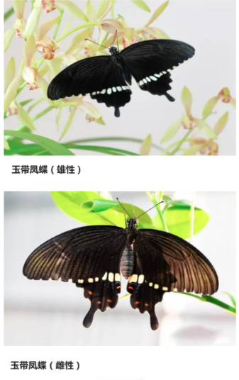
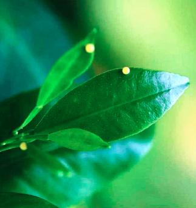
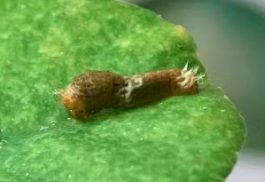
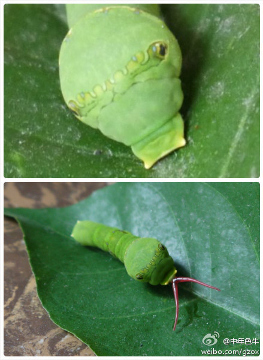
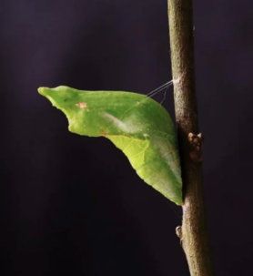

# 玉带凤蝶

|属性|说明|
| ---- | ---- |
| 别称||
| 英文名||
| 属||
| 分布||
| 寿命||
| 外形特征||
| 食性||
| 习性||
| 繁殖||

【习性】成虫产卵时通常会把卵产在芸香科植物的嫩叶尖。

1-3龄体上有肉质突起和淡色斑纹，似鸟粪。

红叉叉是臭腺角，受到骚扰时会伸出来吓唬敌人，像蛇吐信子。同时散发出浓重的气味。幼虫先是拟态鸟屎，后来扮成鸟的天敌。

- [玉带凤蝶-Chelsey的虫子罐-小红书](https://www.xiaohongshu.com/discovery/item/63c22de4000000001f00a4c5?source=webshare&xhsshare=pc_web&xsec_token=AB8DPqc6JydGi2nSdrSgVCOr6HEUNR2rgiIaB6xqmiumQ=&xsec_source=pc_share)