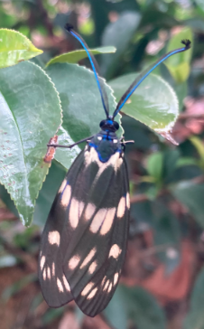
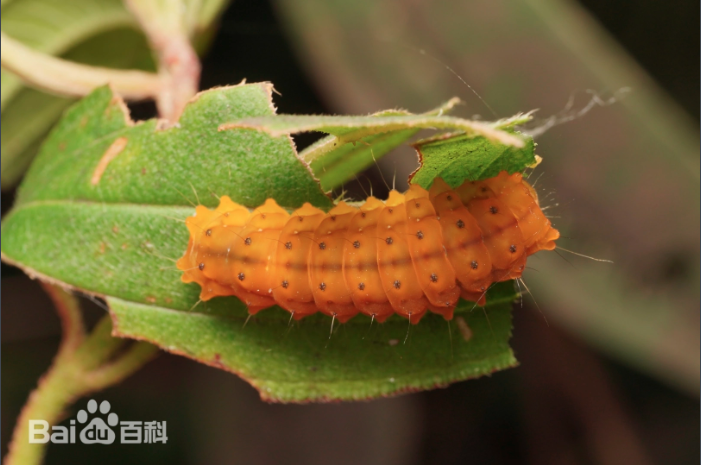

# 茶树茶斑蛾

|属性|说明|
| ---- | ---- |
| 别称||
| 英文名||
| 属||
| 分布||
| 寿命||
| 外形特征| 雄蛾触角双栉齿状，触角呈现漂亮的金属蓝，还有细细的毛边分叉；雌蛾触角基部丝状，上部彬齿状，端部膨大，粗似棒状|
| 食性||
| 习性| 受惊时会分泌带气味的液体，用于劝退捕食者|
| 繁殖||

【幼虫】行动迟缓，受惊后体背瘤状突起处能分泌出透明粘液，但无毒。

参考:
- [茶斑蛾-百度百科](https://baike.baidu.com/item/%E8%8C%B6%E6%96%91%E8%9B%BE)
