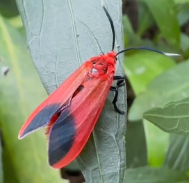
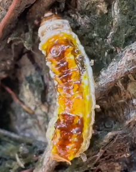

# 朱红毛斑蛾

|属性|说明|
| ---- | ---- |
| 别称| 榕树斑蛾、火红斑蛾|
| 属||
| 分布| 分布于广东、广西、云南、福建、海南等|
| 寿命||
| 外形特征||
| 食性| 榕树、高山榕、气达榕、花叶橡胶榕、印度橡胶榕、青果榕、美丽枕果榕、菩提榕等榕属花木。以幼虫食叶为害，大发生时，可把树木叶片吃光。|
| 习性||
| 繁殖||

幼虫。

参考:
- [朱红毛斑娥-百度百科](https://baike.baidu.com/item/%E6%9C%B1%E7%BA%A2%E6%AF%9B%E6%96%91%E8%9B%BE/2376772?fr=ge_ala)
- [朱红毛斑娥-虫间-bilibili](https://www.bilibili.com/video/BV1wx4y197Bz/?share_source=copy_web&vd_source=fcf7bbddc2ffd7f073481728ff8f0f3c)
