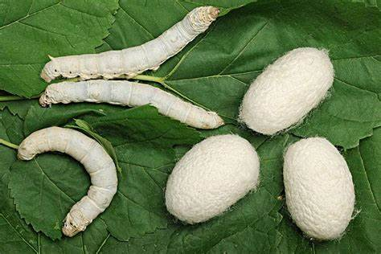

# 蚕

|属性|说明|
| ---- | ---- |
| 别称| 家蚕|
| 属||
| 分布||
| 寿命||
| 外形特征||
| 食性||
| 习性||
| 繁殖||

蛹便。蛹它不吃不拉，但是它会代谢，它把那些排泄物攒在肚子里头，等羽化的时候，就会滋红色的水，即蛹便。

参考:
- [亮记生物鉴定-bilibili](https://www.bilibili.com/video/BV1RK411t7WS/?share_source=copy_web&vd_source=fcf7bbddc2ffd7f073481728ff8f0f3c)
