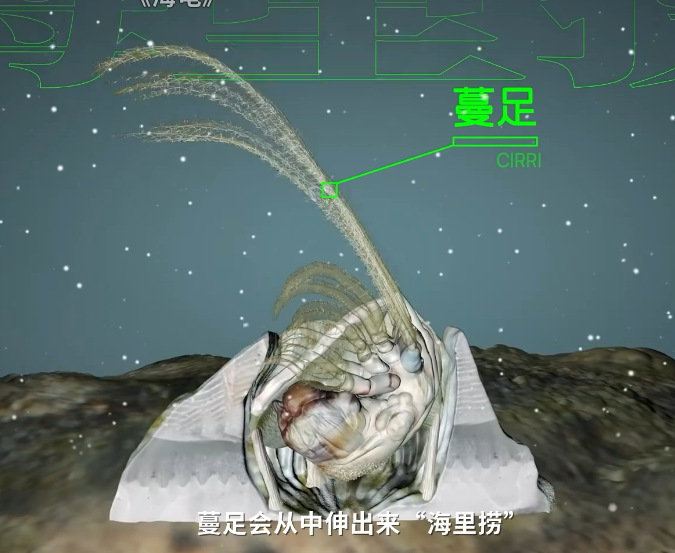
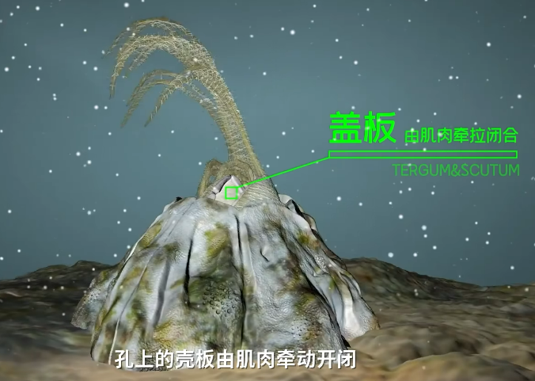
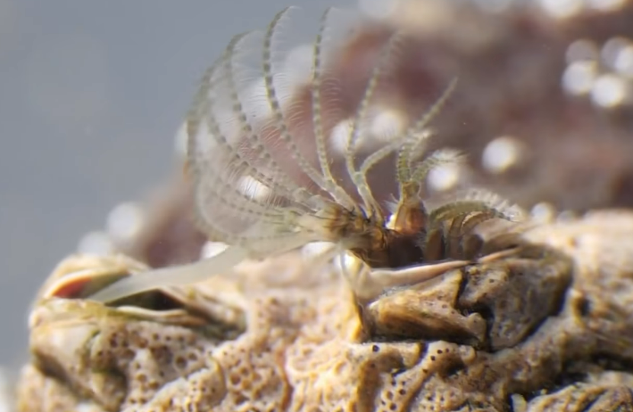

# 藤壶

|属性|说明|
| ---- | ---- |
| 别称||
| 属||
| 分布||
| 寿命||
| 外形特征||
| 食性||
| 习性||
| 繁殖| 虽为雌雄同体，但多为异体受精。|

幼体为自游生物，但成年后无法靠自己移动，只能固着在坚硬物体表面(如岩石，轮船，鲸鱼)。

藤壶的幼虫无节幼体，经2-3周的发育，成为腺介幼体，腺介幼体在合适的附着物上吸附、固定。固定前腺介幼体用触角附着接触面，这种附着容易移动。故称为暂时粘附；此时若附着物表面适合附着。腺介幼体则会由暂时粘接转变为永久性粘接。固着后的腺介幼体发生变态成为藤壶成体，藤壶成体在附着基表面分泌出藤壶胶，使附着更加牢固。

繁殖时会将交配器让附近的藤壶受精。

参考:
- [藤壶-百度百科](https://baike.baidu.com/item/%E8%97%A4%E5%A3%B6/2420731?fromModule=lemma_search-box)
- [藤壶-锦鲤实验室-bilibili](https://www.bilibili.com/video/BV16d4y1s7va/?spm_id_from=333.337.search-card.all.click&vd_source=741bff59809f9e15c309ef97c7d7c960)
