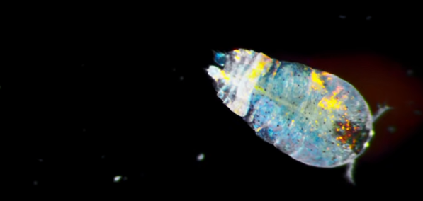

# 叶水蚤

叶水蚤是一种体长只有几毫米的细小的甲壳类生物。雄性的叶水蚤通常拥有美丽的色彩，尤其是一些种类的叶水蚤呈现鲜艳的蓝紫色，被誉为“海中蓝宝石”。更为奇特的是，叶水蚤在水中游动时，常常会突然从蓝色变为无色透明，像是消失了一样。

身上的色彩不是因为它自己在发光，而是它身体表面的细小晶片，能否反射再衍射出彩虹光。

参考:

- [百度百科](https://baike.baidu.com/item/%E5%8F%B6%E6%B0%B4%E8%9A%A4/20627406?fr=aladdin)
- [亿点点不一样](https://www.bilibili.com/video/BV18P4y1S7Qg/?spm_id_from=333.999.0.0&vd_source=741bff59809f9e15c309ef97c7d7c960)