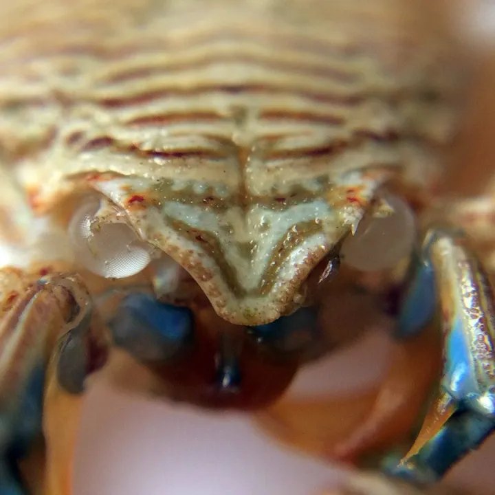

# 节肢动物门

节肢动物生长过程中要定期蜕皮。前后两次蜕皮之间的阶段叫做龄期。

蜕皮(ecdysis)指蜕皮(ecdysis)指的是节肢动物在发育过程中周期性地丢弃体表分泌物形成的外皮的一类现象的是节肢动物在发育过程中周期性地丢弃体表分泌物形成的外皮的一类现象。

一只瓷蟹蜕下的壳，仔细观察可以看到上面留下的复眼痕迹。

但是，不管人类在文化层面上给这些“金蝉脱壳”“破茧成蝶”的行为赋予多么美好的寓意，就生存而言，蜕皮真的是个很糟糕的性状：首先，导致了外骨骼硬化期间无力对敌的虚弱期；其次要抛弃自己不舍昼夜积累下来的钙质等元素，造成严重的资源浪费；有时被惊扰或者哪里卡住就可能被困死在壳里。凡此种种，在蜕皮带来的诸般掣肘面前，再生肢体这一优势显得微不足道。如此费力不讨好的性状为什么会得以保留下来?

当然，大家已经很熟悉对这道谜题的其中一个解答了：节肢动物的外骨骼弹性很差，无法跟随身体成长，也就是说，蜕皮是节肢动物获得刚性的外骨骼所付出的代价。但事情没有那么简单：一些节肢动物的外壳变得高度柔软，但依旧需要经历蜕皮。

对于蜕皮动物，学界猜测它们的祖先没有用于运动的纤毛，而是利用体表的刺、环节或凸起在泥沙中伸缩蠕动。蜕皮行为的诞生，就是因为这些在体表辅助运动的结构无法跟随身体长大。

参考:

[环形剧场现任负责人-zhihu](https://www.zhihu.com/question/421168463/answer/1491311719)