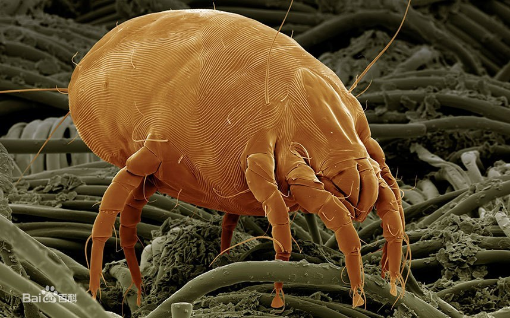

# 尘螨科

尘螨的主食是霉菌，也会以人类表皮分泌的碎屑为食。一些尘螨过敏的人，主要是因为吸入了尘螨或者尘螨的排泄物/蜕的皮。

尘螨最适宜生活的湿度是百分之六十到七十。所以如果是环境比较干旱，螨虫不会太多，不太需要除螨。要防止螨虫，可以考虑加装除湿器，将房间的湿度维持在百分之五十以下，早上起床的时候可以把被子掀开，防止形成温暖湿润的环境利于螨虫繁殖。

参考:
- [尘螨-萝卜2号-bilibili](https://www.bilibili.com/video/BV1AU4y18773/?spm_id_from=333.788&vd_source=741bff59809f9e15c309ef97c7d7c960)
