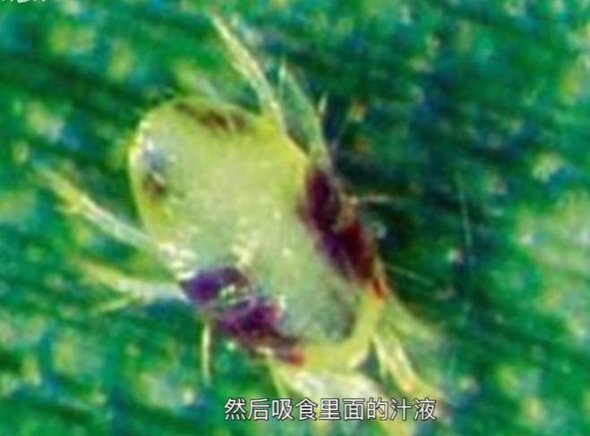

# 叶螨科

许多叶螨身上有红色的斑纹或大块红色，又像蜘蛛一样能够结网，就得到了“红蜘蛛”这个俗名。

它们大多以叶肉为食，如果数量过大，会严重影响叶子的营养传输。

是典型的R型物种生长速率极快

参考:
- [叶螨-萝王2号-bilibili](https://www.bilibili.com/video/BV1ef4y1z7We/?spm_id_from=333.337.search-card.all.click&vd_source=741bff59809f9e15c309ef97c7d7c960)