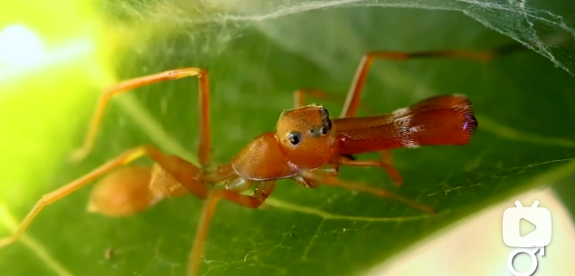
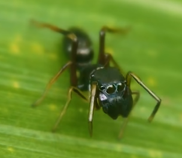

# 蚁蛛

|属性|说明|
| ---- | ---- |
| 别称||
| 属||
| 分布||
| 寿命||
| 外形特征| 拟态蚂蚁|
| 食性||
| 习性| 蚁蛛还保留着跳蛛跳跃的能力；能够吐丝。|
| 繁殖||

【拟态蚂蚁】因为蚂蚁不仅有很强的上颚和蚁酸，而且还有很强的社会性攻击能力，因此很多捕食者如鸟类和捕食性昆虫及蜘蛛不仅不捕食而且会避开蚂蚁。这样的话，蚁蛛就可以通过模拟蚂蚁以避免被捕食。

【性别二态性】雌性长得比较像蚂蚁，而雄性螯肢极发达，长大而粗壮，向前突出。

雄性黄蚁蛛。

雌性日本蚁蛛。

参考:
- [蚁蛛-百度百科](https://baike.baidu.com/item/%E8%9A%81%E8%9B%9B/6529314?fr=ge_ala)
- [蚁蛛-万物深蓝-bilibili](https://www.bilibili.com/video/BV1C841127SE/?spm_id_from=333.1007.top_right_bar_window_view_later.content.click&vd_source=741bff59809f9e15c309ef97c7d7c960)
