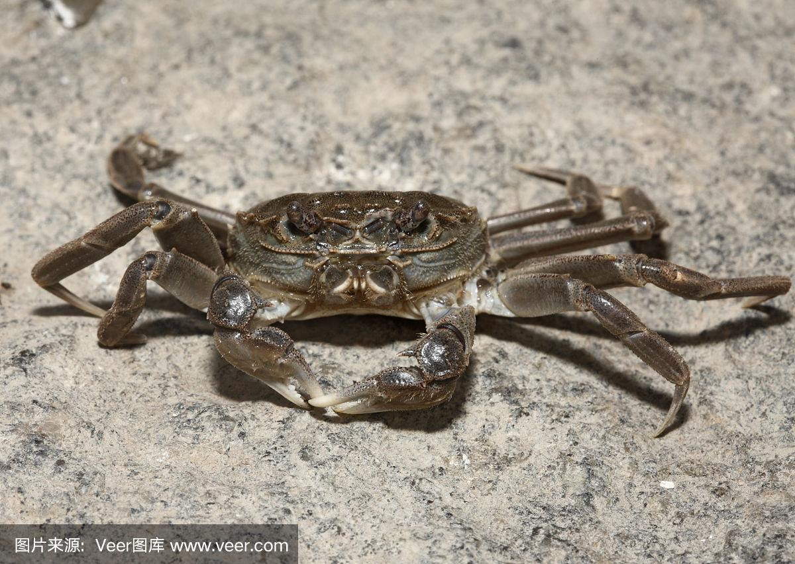
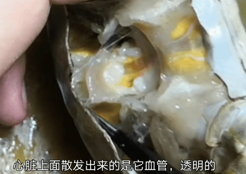
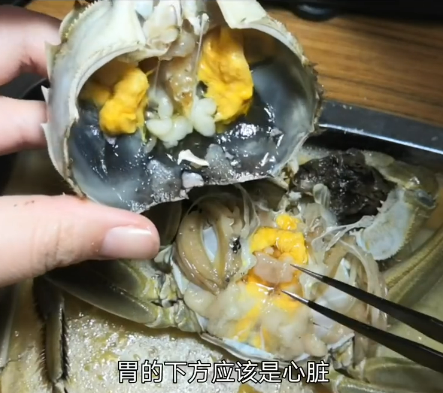
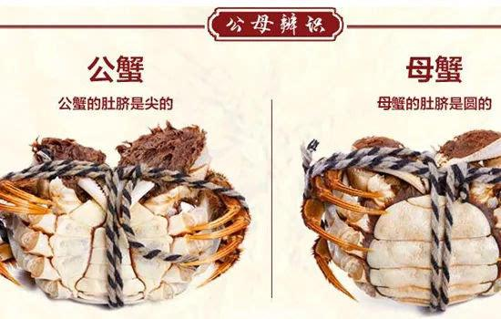
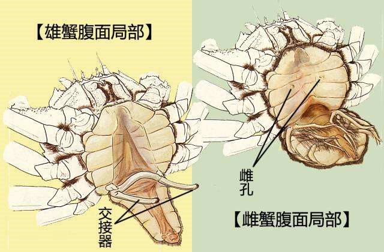
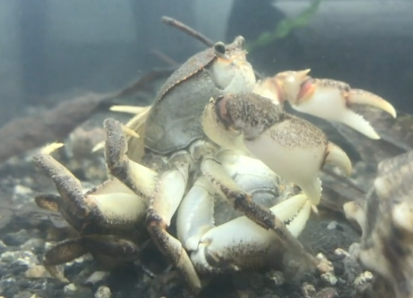

# 中华绒螯蟹

|属性|说明|
| ---- | ---- |
| 别称| 海毛蟹、毛蟹、河蟹|
| 属| 绒螯蟹|
| 分布| 常穴居江、河、湖荡泥岸。|
| 寿命||
| 外形特征| 公蟹肚脐是尖的，母蟹肚脐是圆的。|
| 食性| 以动物尸体或谷物为食。|
| 习性||
| 繁殖||

【大闸蟹解剖】大闸蟹的食道很短，嘴后面是胃。“蟹黄”其实是它的肝胰腺。

【生殖系统】大闸蟹交配的时候两两成对，相互打开腹部，两蟹腹部相对，雌蟹把腹部打开漏出雌孔，雄蟹打开腹部将其交接器对准雌蟹的雌孔。

溪蟹(非大闸蟹)交配示意图。

【六月黄】

“六月黄”是大闸蟹进入成熟期前的最后一次蜕壳，亦是大闸蟹从“少年”步入“青年”的中间阶段。少年大闸蟹正为跨入成年积蓄能量，体内的蟹黄还没有发生转变，含量几乎达到顶峰。六月黄，最初为控制养殖密度而提前出水，却因为壳薄黄多，让食客的馋虫提前得到满足。

参考:

- 纪录片《风味人间第二季》
- [大闸蟹解剖-笨熊脑袋-bilibili](https://www.bilibili.com/video/BV1kP4y1b7FW/?spm_id_from=333.337.search-card.all.click&vd_source=741bff59809f9e15c309ef97c7d7c960)
- [螃蟹交配-ChatWithBai-bilibili](https://www.bilibili.com/video/BV1NE411b7A3/?spm_id_from=333.337.search-card.all.click&vd_source=741bff59809f9e15c309ef97c7d7c960)
- [大闸蟹生殖系统](https://www.sohu.com/a/328537804_120153979)
