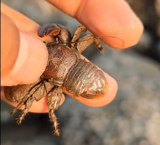
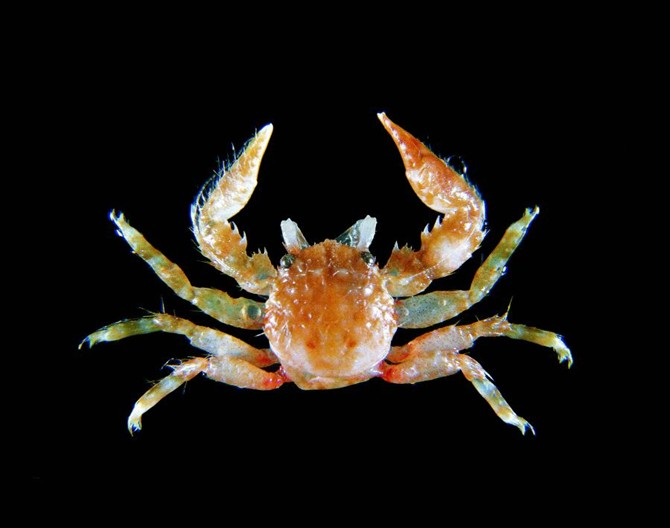
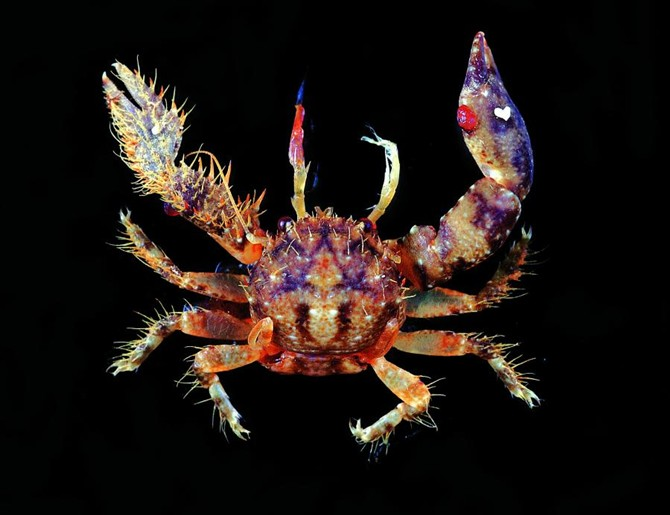
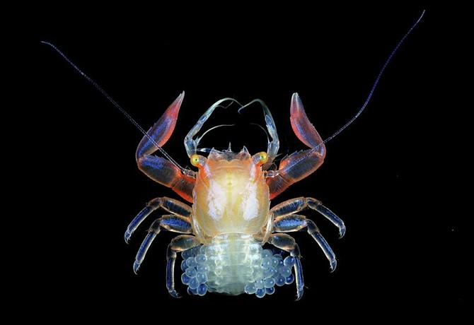
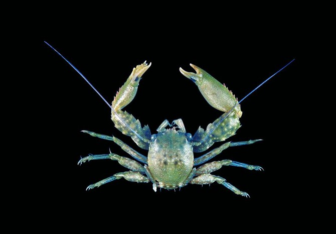
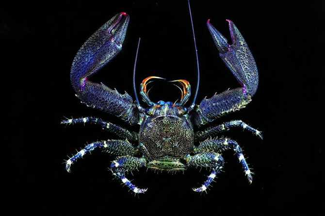
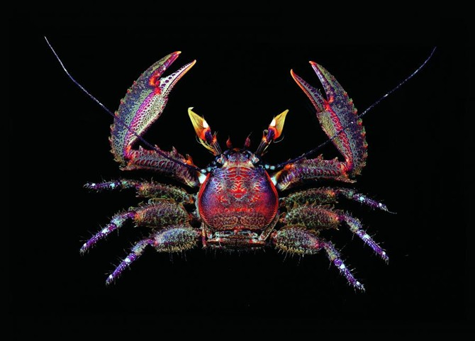
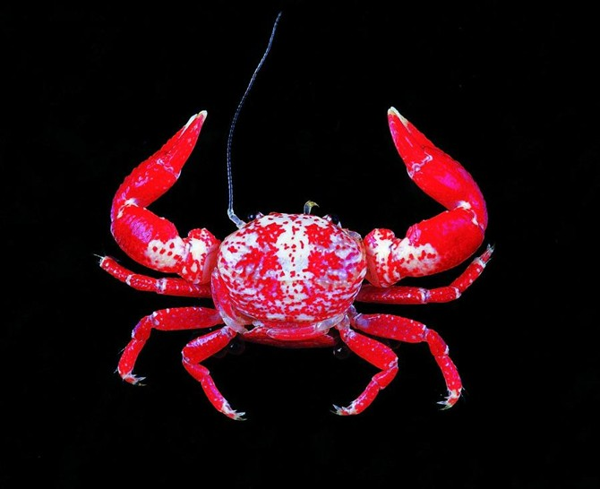

# 瓷蟹科

瓷蟹，瓷蟹（礁蟹）事实上并不是“真正的蟹”，而是一种通过进化，逐渐变得像蟹的龙虾。尾巴折起来的时候像螃蟹一样，但是展开来以后就像虾一样。

与瓷器一样，这些蟹非常美丽且易碎，在躲避天敌时经常会失去附肢，但是稍后它们会很快长出新的。当他们受到食肉动物的威胁时，就会抛掉一条腿或爪来分散攻击者的注意力。他们所丢弃的部分还会在不久之后长出来。

卡氏異瓷蟹

微異瓷蟹

四葉光滑瓷蟹

刺額光滑瓷蟹

亞洲岩瓷蟹

紅褐岩瓷蟹

肥胖多指瓷蟹

参考:
- [瓷蟹-百度百科](https://baike.baidu.com/item/%E7%93%B7%E8%9F%B9?fromModule=lemma_search-box)
- [典藏台湾](https://catalog.digitalarchives.tw/Catalog/List.jsp?CID=5257)
= [360doc](http://www.360doc.com/content/17/0121/09/8527076_577598599.shtml)
