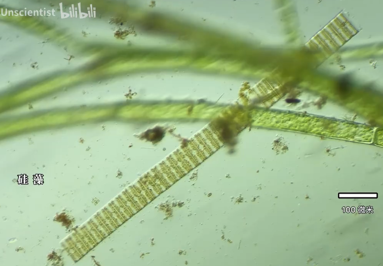
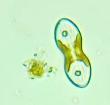

# 硅藻纲

硅藻淡水海水土壤里都有，大概是除了细菌以外水里最常见的生物之一。它们的数量巨大，地球每年产生氧气的20%到50%都是由硅藻制造的；它们拥有神奇的外壳，"人死了壳还在"，外壳的主要成分是二氧化硅，是穿着玻璃的地球生物。

参考:
- [一滴水里的动物园-地下科学家-bilibili](https://www.bilibili.com/video/BV1g34y1H7Vp/?spm_id_from=333.337.search-card.all.click&vd_source=741bff59809f9e15c309ef97c7d7c960)
