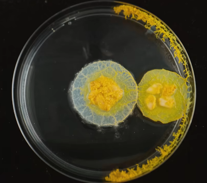

# 黏菌门

黏菌虽然是一种单细胞生物，但能以相互关联的网络状成长。黏菌平时单独活动，只有在繁殖的时候才会聚集起来，形成多细胞的个体。

它的食性广泛。但当食物匮乏时，黏菌就会变硬变干，要想让它苏醒，只需要给它一点水。
日本科学家用黏菌做迷宫实验，能够选择获取食物的最短路径。

像蚂蚁会释放信息素一样，黏菌也会利用自己的粘液，创造一种外部记忆，使其从不走回头路。

参考:
- [黏菌-曳尾菌-bilibili](https://www.bilibili.com/video/BV1bU4y1F7rF/?spm_id_from=333.337.search-card.all.click&vd_source=741bff59809f9e15c309ef97c7d7c960)
- 纪录片《神奇黏菌》