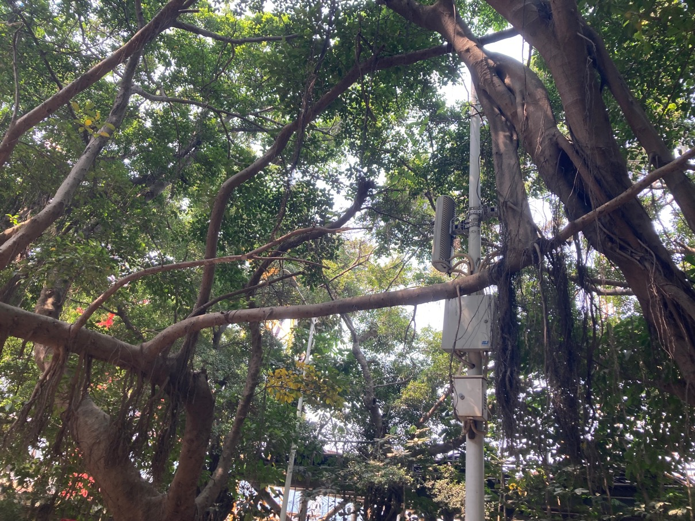

# 连理枝

两颗榕树的枝干融合在了一起。

[连理枝照片](https://www.alamy.com/stock-photo/two-trees-growing-together.html?sortBy=relevant)

连理枝(Inosculation)是一种自然现象，树木的树干、树枝或树根生长在一起，类似于人工嫁接过程。同一物种生长在一起最为常见。两棵树在彼此附近生长，在风的作用下，两棵树枝干相接触，互相摩擦，表皮磨损，一旦两棵树的形成层相接触，会相互增生产生新的细胞。

参考:
- [连理枝-百度百科](https://baike.baidu.com/item/%E8%BF%9E%E7%90%86%E6%9E%9D/59549?fr=aladdin)