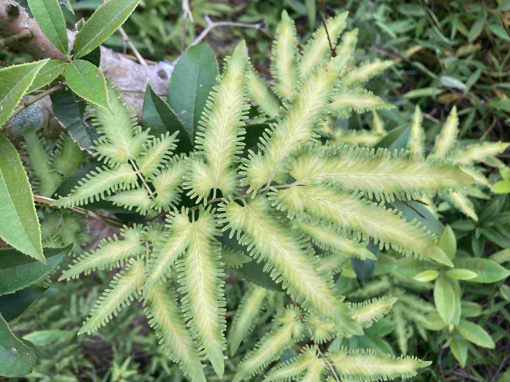
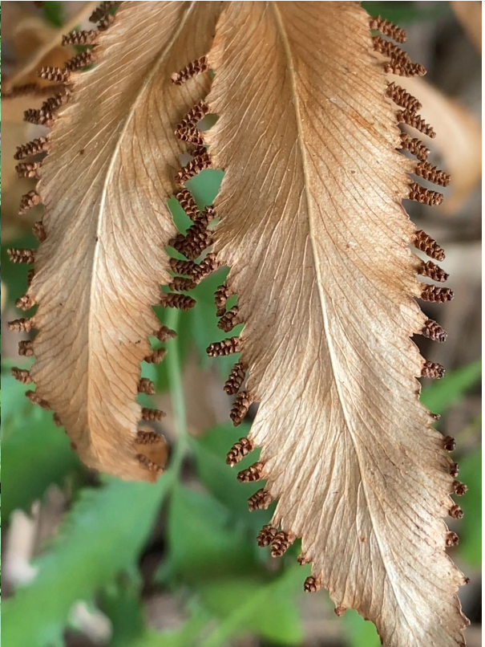

# 海金沙科

上图拍摄于深圳大南山

特征：

1. 多年生藤本蕨類，長1~5公尺。
1. 地下根莖匍匐狀，葉近生。
1. 葉軸頂端有休眠芽，能無限生長。
1. 整個葉片呈纏繞狀或攀援狀，常攀附在其他植物身上。
1. 孢子囊長在能育小羽片的指狀裂片邊緣，呈深褐色。左右兩列排列成穗，每個孢子囊都有孢膜。

【繁殖】孢子囊穗沿着叶缘排列，呈现出独特的流苏状齿边结构，孢子成熟后为暗褐色，金黄细腻如沙子，这也是它“海金沙”名称的来源。

参考:
- [海金沙-台湾环境咨询协会](https://teia.tw/archives/natural_valley_star/pp2017-08-01)
- [百度](https://mbd.baidu.com/newspage/data/dtlandingsuper?nid=dt_4949634851147004549)