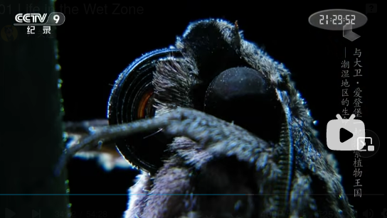

# 兰科

兰科同菊科是开花植物里最大的两个科。

兰科为多年生草本，生活方式有地生、附生(或有岩生，像独蒜兰在野外就经常在一个湿润的岩壁上开一大片)和腐生。

假鳞茎是兰科植物特有的器官，是两片叶子的结处产生的变态茎，是水和养分的贮藏器官。一些兰花的假鳞茎看起来很平常，跟其他长满叶子的植物茎没什么两样。像独蒜兰的假鳞茎形至卵状圆锥形。

兰花花朵的下唇瓣是由一组特殊的基因控制的，这意味着它们能进化改变下唇瓣的形状颜色，并同时保持其他花瓣不变。

兰花代表了植物和动物共同进化的巅峰。对植物来说，最极端的一种合作方式，就是只有一种动物能够获取其中的花蜜(专性传粉共生关系，可以提升传粉的效率，保证好不容易骗昆虫沾上的花粉是传到了同类的柱头上。同时昆虫也获得了较充足的食物)。彗星兰的花蜜位于花朵的背部极长的花距末端， 马岛长喙天蛾进化出了30多厘米长的口器，与花距长度一致。

参考:
- [兰花-中国国家地理-bilibili](https://www.bilibili.com/video/BV1NV4y1s7dE/?spm_id_from=333.337.search-card.all.click&vd_source=741bff59809f9e15c309ef97c7d7c960)
- Kindom of Plants(植物王国)-纪录片
