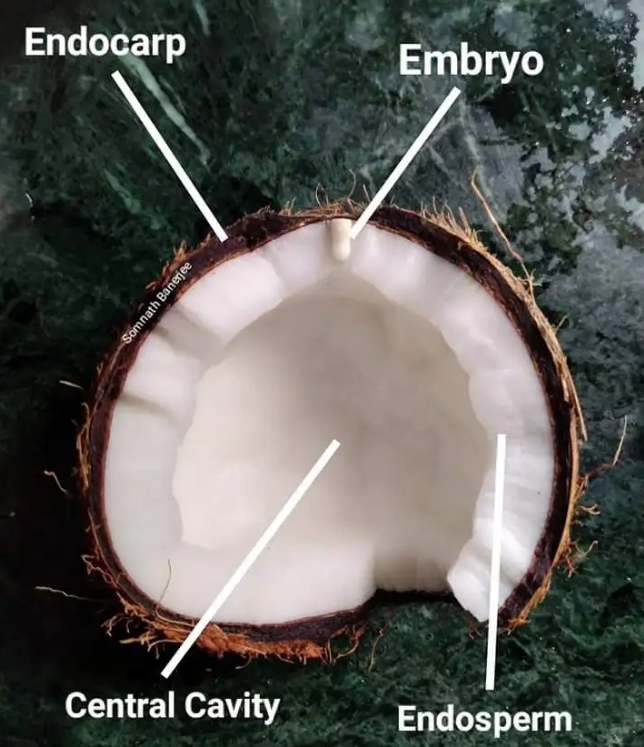

# 椰子

|属性|说明|
| ---- | ---- |
| 别称||
| 属||
| 分布||
| 寿命||
| 外形特征||
| 繁殖||

【繁殖】椰汁和椰肉都属于胚乳，成熟的椰子椰肉更多。椰子幼态时有三个胚，椰子外壳上的三个孔用于萌发，有两个胚会退化，最终只形成一个完整胚。对应的孔为真孔，另外两个为假孔，真孔更易打破。上图的Embryo为胚。椰子内部的空腔结构，让它能漂浮在海上，让大海帮忙传播。

【食】椰青，未成熟就采摘的椰子，削去外皮之后叫做椰青，味道清甜；椰皇，成熟后将表面棕毛去除打磨得到。

参考:
- [椰子生根发芽-zhihu](https://www.zhihu.com/question/580501201)
