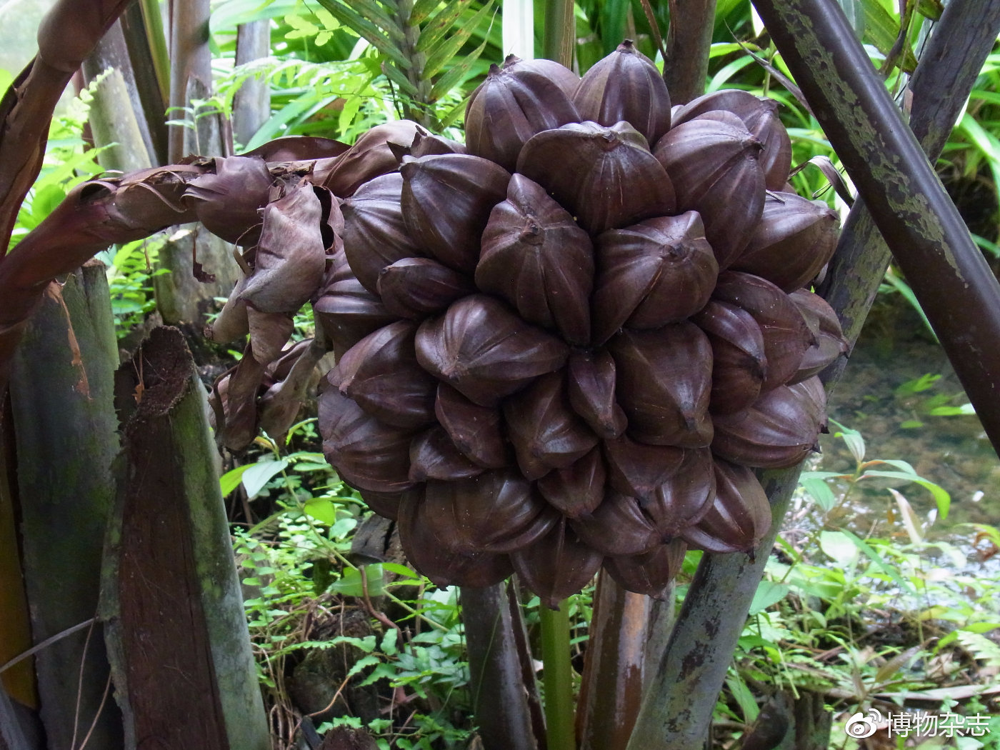

# 水椰

|属性|说明|
| ---- | ---- |
| 别称||
| 属||
| 分布||
| 寿命||
| 外形特征| 果实也被成为亚达子， 果实结在根部露出睡眠。可食率极低。羽状树叶可以用来造屋顶。|
| 繁殖||

水椰是少有可以生活在水中的棕榈科植物，是一个非常古老的孑[jié]遗物种(指过去分布比较广泛，而现在仅存在于某些局限地区的古老动植物种)。

参考:
- [果知台-水椰-youtube](https://www.youtube.com/watch?v=zDnL7GniGI8)
