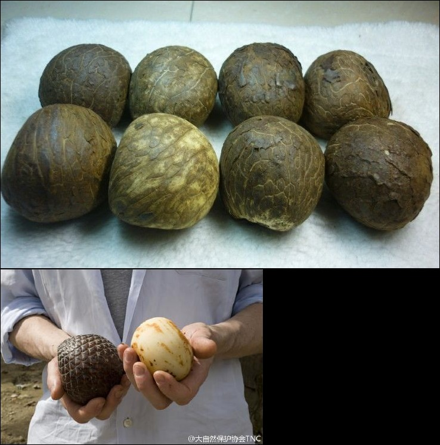

# 象牙椰

|属性|说明|
| ---- | ---- |
| 别称||
| 属||
| 分布||
| 寿命||
| 外形特征||
| 繁殖||

乳的果实起初为液体状，晶莹欲滴，但成熟以后变得坚硬起来，具备了与动物象牙类似的特点，有年轮般的环状图案，其纹理、硬度、颜色，看起来和真的象牙一样，被称为象牙果。

完全干燥的象牙果，是一种极佳的天然雕饰材料。

参考:
- [象牙果-百度百科](https://baike.baidu.com/item/%E8%B1%A1%E7%89%99%E6%9E%9C?fromModule=lemma_search-box)
