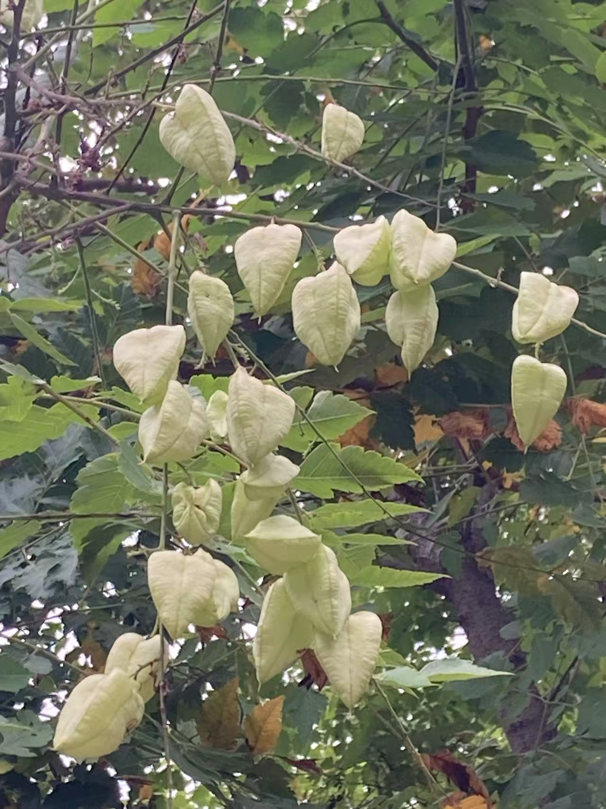
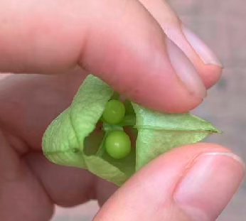

# 栾树

|属性|说明|
| ---- | ---- |
| 别称| 灯笼树|
| 属||
| 分布||
| 寿命||
| 外形特征||
| 繁殖||
| 毒性||

【果实】栾树的蒴果(蒴果是一种干果，它成熟后会以多种方式开裂，从而释放出种子)簇生，串状，单个果实为泡囊状，由三个苞片所围成，内含3-6粒种子。北京栾苞片为三角形，薄纸状质地，黄绿色，或微带红色，表面微皱，成熟后为红褐色；而黄山栾苞片为椭圆形，为很薄的宣纸状质地，十分娇嫩，初时浅绿色，果实成熟后变成红色，甚至紫红色，十分美观。成熟干燥后的串串栾树蒴果经微风一吹，唰唰作响，似古时铜钱的响声，因而有的地方称栾树为“摇钱树”。由于黄山栾红色的蒴果很像一个个圆圆的小灯笼挂在一起，因而，有人又称栾树为“灯笼树”。

参考:

- [栾树-绿色中国](https://www.greenchina.tv/magazine/detail/id/507.html)