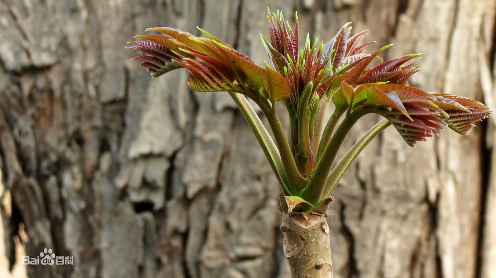

# 香椿

|属性|说明|
| ---- | ---- |
| 别称||
| 属||
| 分布||
| 寿命||
| 外形特征||
| 繁殖||

香椿是民间喜采食的传统“树头菜”之一，也是时令名品，具有浓郁的芳香气味。香椿的幼芽嫩叶芳香可口，供蔬食以春季嫩芽梢枝作蔬菜用。

参考:
- [香椿-百度百科](https://baike.baidu.com/item/%E9%A6%99%E6%A4%BF/1177303)
