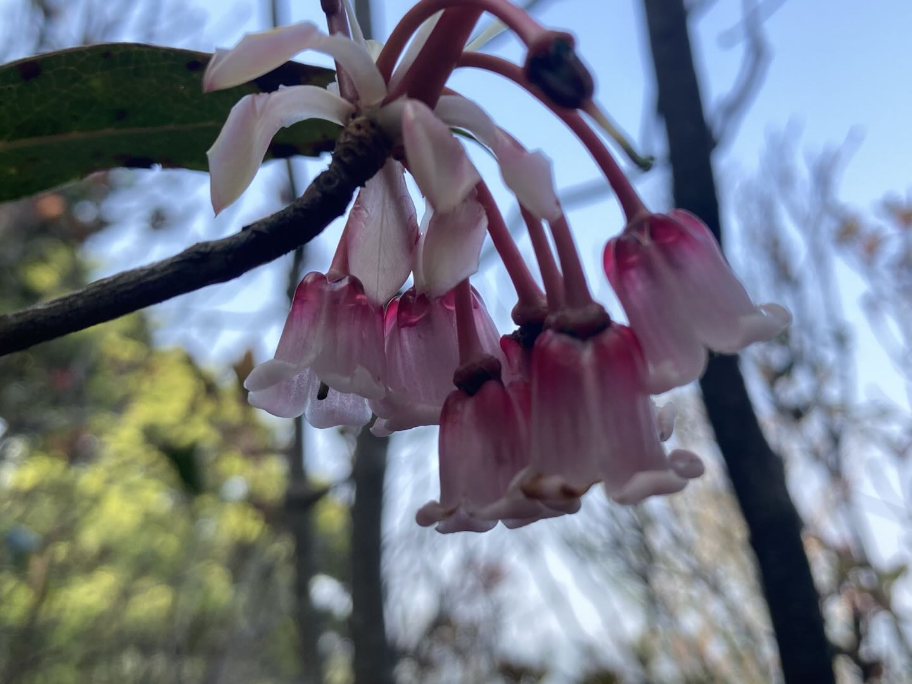
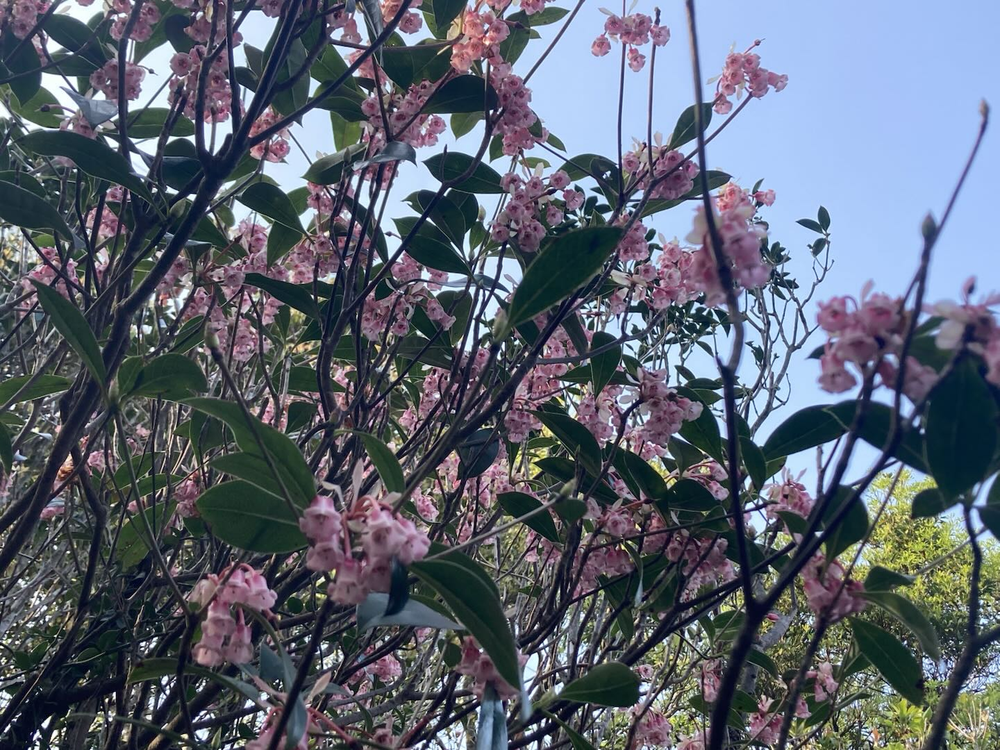
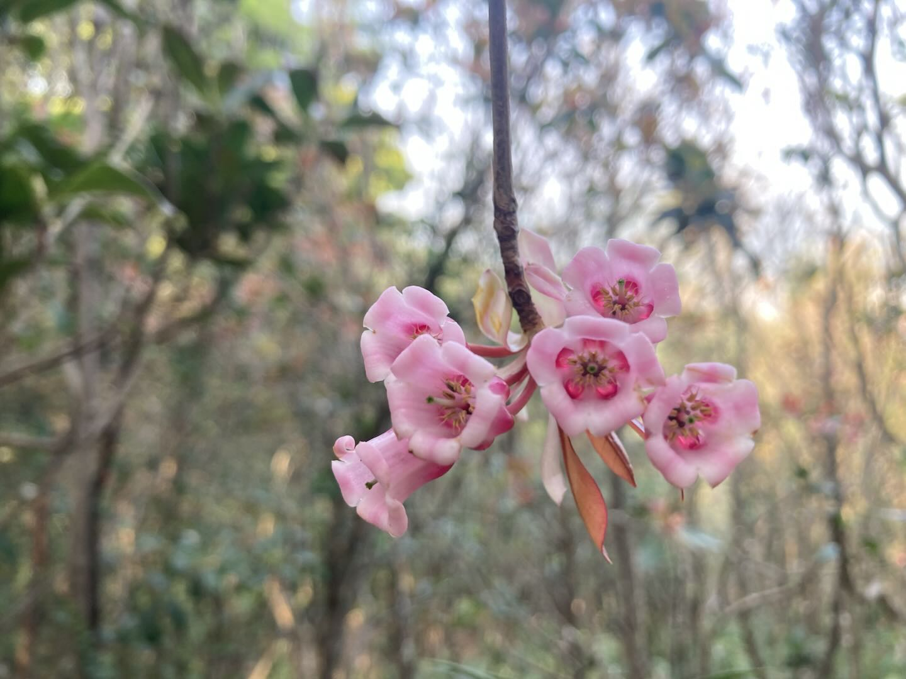

# 吊钟花

|属性|说明|
| ---- | ---- |
| 别称|铃儿花|
| 学名|Enkianthus quinqueflorus|
| 属|吊钟花属（Enkianthus）|
| 分布||
| 花期||
| 外形特征||
| 习性||
| 繁殖||

【文化故事】有一年，一个城市发生了一场巨大的灾难，他们遭到了邻国的进攻，这场残酷的战争持续了很久，许多士兵都在这场战争中倒下，每天城里的丧钟一直响个不停，全城笼罩在巨大的悲哀之中。

在每一朵吊钟花里，都住着一个吊钟精灵，精灵去求地方不要开战，却被拒绝。后来精灵用自己的生命把地方的大炮火药变成了花朵，换来了和平。

参考:
- [百度百科 - 吊钟花](https://baike.baidu.com/item/吊钟花/660685)
- 形色识花
