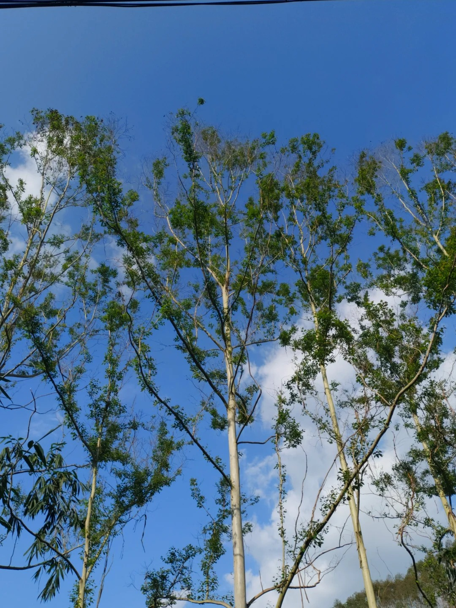

# 速生桉

|属性|说明|
| ---- | ---- |
| 别称||
| 属||
| 分布||
| 寿命||
| 外形特征||
| 繁殖||

桉树并不是指单独一种树，而是桃金娘科桉属植物的统称。

【经济作物】桉树木材产率很高，多作为用材林栽培，长得快的一年高达十米。主要用作制浆造纸、纤维板、胶合板、黏胶纤维等。

【化感作用】桉树有毒的另一个证据是它会妨害其他植物生长。植物通过根系等分泌物质抑制竞争对手的生长称为化感作用，这是一种比较普遍的现象。许多经济树种，如黑胡桃、杉木、竹林中都发现了这一现象。事实上，桉树的化感作用对其他植物的影响并没有那么大，许多研究证明在合理栽培的情况下，桉树人工林下物种丰富度也较高。有时桉树林中“寸草不生”，更多是由种植太密集，林下无阳光且对营养物质的竞争激烈导致。

参考:
- [桉树-博物-zhihu](https://zhuanlan.zhihu.com/p/709297576)