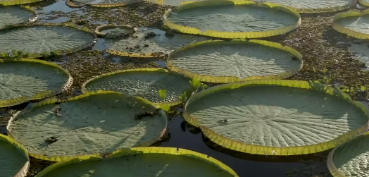

# 亚马逊王莲

|属性|说明|
| ---- | ---- |
| 别称||
| 属| 王莲属|
| 分布||
| 寿命||
| 外形特征| 用于吸收阳光的巨大叶片直径超过两米。幼苗带着刺朝着阳光生长，尖刺保护它不会被鱼类捕食。刺手会在水面绕圈，为叶片清出一片生长空间。带着刺的叶片含着来到水面，暴力展开占据空间。每株亚马逊王莲拥有40多片叶子，面积相当于一个足球场。 叶片上布满了小孔，雨水可以顺着小孔流走，不容易积水。 在其叶片和叶脉中，有着许多充满气体的空腔，可以承受数十千克的负重。|
| 繁殖| 花朵可以完全合拢，将昆虫困在其中几个小时，以确保传粉成功。|

参考:
- 绿色星球-纪录片
- Kindom of Plants(植物王国)-纪录片
- [亚马逊王莲-百度百科](https://baike.baidu.com/item/%E4%BA%9A%E9%A9%AC%E9%80%8A%E7%8E%8B%E8%8E%B2?fromModule=lemma_search-box)
