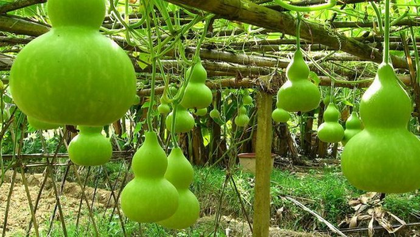
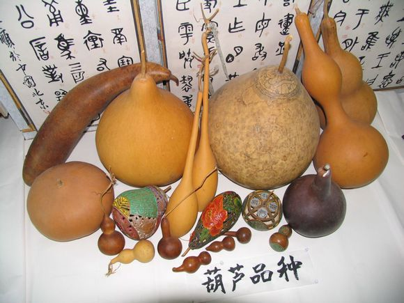

# 葫芦

|属性|说明|
| ---- | ---- |
| 别称||
| 分布||
| 寿命| 一年|
| 外形特征| 果实成熟后有木化外皮。葫芦的细腰和花朵中的重瓣品种一样，本质上是一个与自然属性背道而驰的，人类选择的结果。|
| 繁殖||

参考:
- [葫芦-zhihu](https://www.zhihu.com/question/35242217/answer/80986982)
- [eLapse-葫芦生长-youtube](https://www.youtube.com/watch?v=d43CT_mWzJ0)
