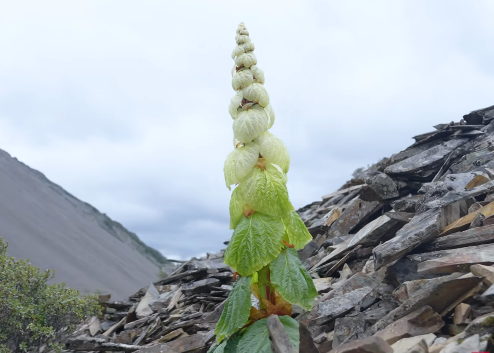
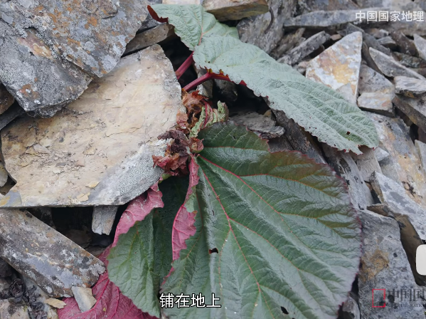
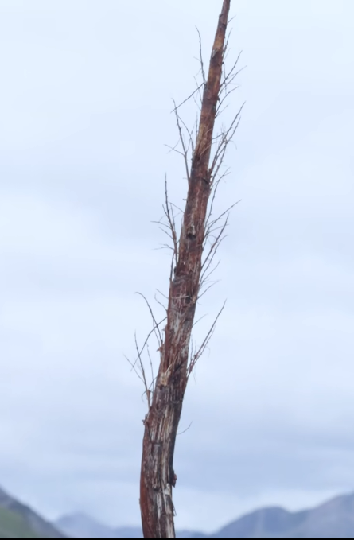

# 塔黄

|属性|说明|
| ---- | ---- |
| 别称||
| 分布| 喜马拉雅山麓|
| 寿命||
| 外形特征|开花以前的塔黄并不起眼，乍一看去，很像一棵大白菜。但是到了开花这一年，它会长出高达1.5-2米的花序，由下向上逐渐变细；花序外面一层一层包裹着大型半透明的奶黄色苞片，其实这是变态的叶。这时候，它成了喜马拉雅高山地区“身材”最高的草本植物，远远望去，好似一座金碧辉煌的宝塔，格外醒目，“塔黄”一名便由此而来。 植物的繁殖器官对于低温是非常敏感的，花粉和胚珠的形成、发育等生理活动的进行尤其如此。塔黄的苞片互相重叠，将所有的花部器官严严实实地包裹起来，能够有效地保存热量，像温室大棚一样，能有效增加花部器官的温度，在晴朗的正午，增温甚至可达10℃以上，为繁殖器官的正常发育提供了良好的温度条件。塔黄的苞片互相重叠，将所有的花部器官严严实实地包裹起来，能够有效地保存热量，像温室大棚一样，能有效增加花部器官的温度，在晴朗的正午，增温甚至可达10℃以上，为繁殖器官的正常发育提供了良好的温度条件。|
| 繁殖| 是单次结实的多年生草本植物，据中科院昆明植物所研究，塔黄平均33.5年开一次花，一生只开一次花。 为塔黄传粉的是迟眼蕈[xùn]蚊(可能也不止一种)，它们对紫外线波段的光比较敏感。塔黄的苞片能够反射大量的紫外线，并且像旗帜一样矗立在流石滩上。对于传粉昆虫来说，塔黄的苞片就像一面面巨大的反光镜，很容易被传粉昆虫注意到。|

开花前的塔黄。

死去的塔黄。

参考:

- [百度百科-塔黄](https://baike.baidu.com/item/%E5%A1%94%E9%BB%84/23645601?fromModule=lemma-qiyi_sense-lemma)

- [bilibili-中国国家地理](https://www.bilibili.com/video/BV17P411E7Jy/?spm_id_from=333.337.search-card.all.click&vd_source=741bff59809f9e15c309ef97c7d7c960)