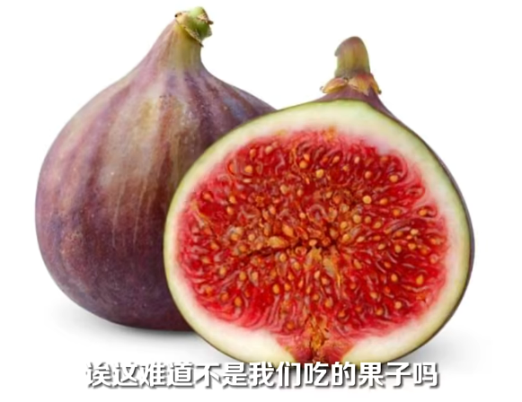
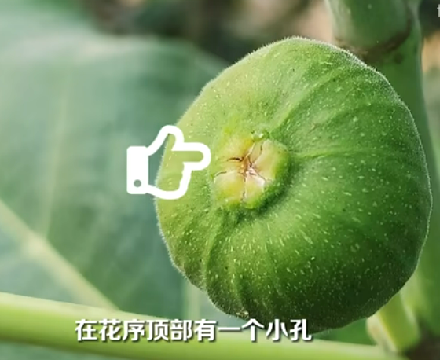
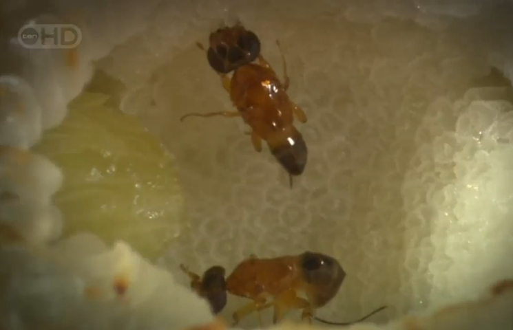
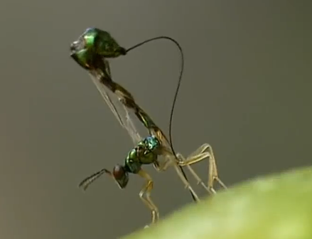
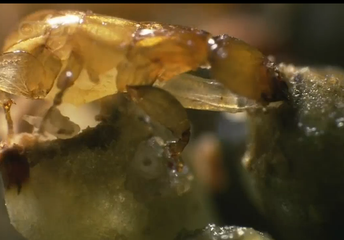

# 无花果

|属性|说明|
| ---- | ---- |
| 别称||
| 属||
| 分布||
| 寿命||
| 外形特征||
| 繁殖||

【隐头花序】平常吃的无花果，其实吃的是它的花。整个花序看起来像个小肉球，这个球是中空的，里面长满了小花。在花序的顶部有一个小孔，这是花序和外界联系的唯一通道。

【热闹的育儿仓】身怀六甲的无花果小蜂，全身附满花粉，从花序顶部的小孔钻进无花果内部，洞很小，雌蜂为了挤进洞内，甚至翅膀都会被挤掉，之后在无花果里面产完卵就死去了。

为了保护小蜂的哺育场不受寄生虫的危害，在雌蜂进入后，无花果就关闭了洞口。未成熟的雄花序，也会牺牲一部分组织，专供小蜂产卵，这个结构叫作[瘿花](动物界/现象/虫瘿/虫瘿.md)。

寄生蜂从大门进不去，就用长长的产卵期从外墙钻孔如破，将卵产到正在发育的无花果小蜂上，孵化的幼虫会杀死小蜂并侵占虫瘿。

大概过了两个月左右。雄蜂会先孵化出来，它们拥有强有力的下颚和单纯的目标。没有翅膀，触角眼睛都很小， 但有长而且灵活的生殖器官，它们会咬开雌蜂的瘿，使其在孵化前受孕。雌蜂孵化后，雄蜂会啃咬无花果顶部的苞片，为雌蜂开路，随后就死去。它们的生命除了在卵里的几个月时间，只有短短的几小时。

雌蜂把花粉蹭出来装在胸部特别的囊里面。飞出无花果的小蜂，又去寻找新的无花果，进行新的生命的轮回。

参考:
- [纪录片-树之女皇]
- [无花果-博物-bilibili](https://www.bilibili.com/video/BV1wj411k73J/?share_source=copy_web&vd_source=fcf7bbddc2ffd7f073481728ff8f0f3c)
