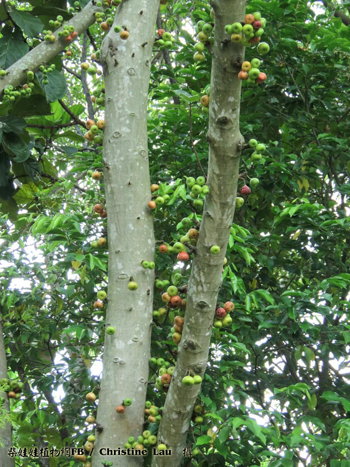
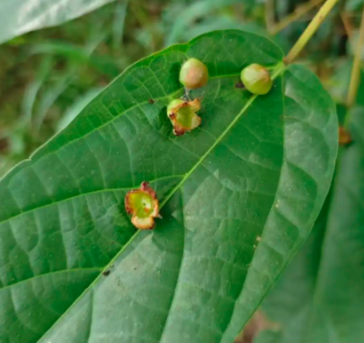

# 青果榕

|属性|说明|
| ---- | ---- |
| 别称| 杂色榕|
| 属| 榕属|
| 分布||
| 寿命||
| 外形特征||
| 繁殖||
| 毒性||

叶子上经常看到长着圆圆的小球，是由虫害造成的凸起物，叫做“虫瘿”。里面住着[青果榕木虱](动物界/节肢动物门/昆虫纲/半翅目/木虱科/青果榕木虱/青果榕木虱.md)。这个虫瘿就像是木虱宝宝的育儿房，既能提供保护又能提供食物。等到木虱长至成虫，虫瘿也会脱水裂开，木虱就会飞离虫瘿。

参考:
- [青果榕-柴娃娃植物网](https://hkcww.org/hkplant/readid.php?id=158)
