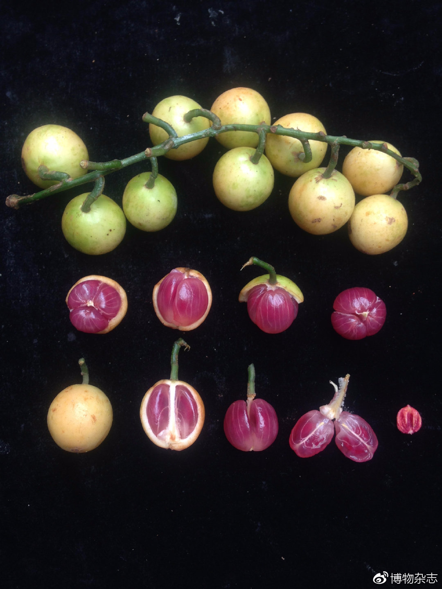

# 木奶果

|属性|说明|
| ---- | ---- |
| 别称| 三丫果|
| 分布||
| 寿命||
| 外形特征||
| 繁殖| [老茎生花](植物界/现象/老茎生花/老茎生花.md)。雌雄异株，花小，无花瓣，棕黄色，花期3-4月。果实裂开后呈三瓣状。|

3-4月开花。

果实可食用。

参考:

- [木奶果-中国科学院](https://www.cas.cn/kx/kpwz/201907/t20190723_4700867.shtml)
