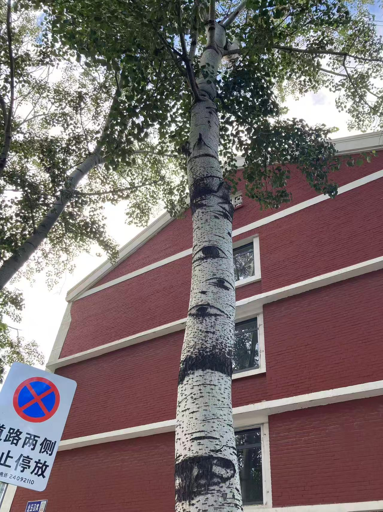
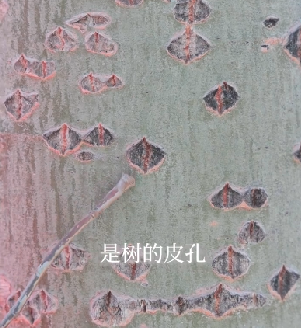
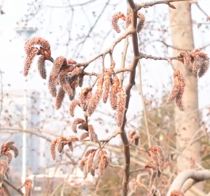

# 毛白杨

|属性|说明|
| ---- | ---- |
| 别称||
| 属||
| 分布||
| 寿命||
| 外形特征||
| 繁殖| 雌雄异株，靠风传粉|
| 毒性||

树皮上的“小星星”，是树的皮孔，用来进行植物的气体交换。树上的“眼睛”是树的枝痕，枝干自然断裂留下的痕迹。

毛白杨的花序。

参考:

- [大树的“心声” - 中国国家地理探索 - 小红书](https://www.xiaohongshu.com/discovery/item/6773f09f000000000b014883?source=webshare&xhsshare=pc_web&xsec_token=ABATVWWxw2pNXWBCE7mwESXqUWtdvKw6tQA7louusLYMg=&xsec_source=pc_share)