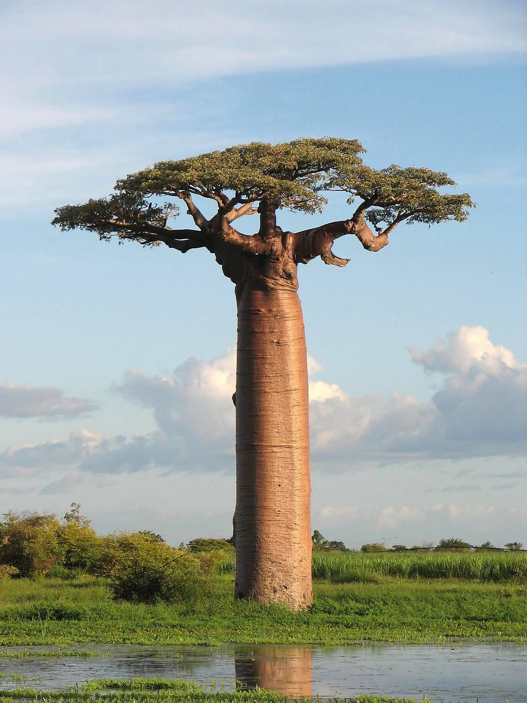
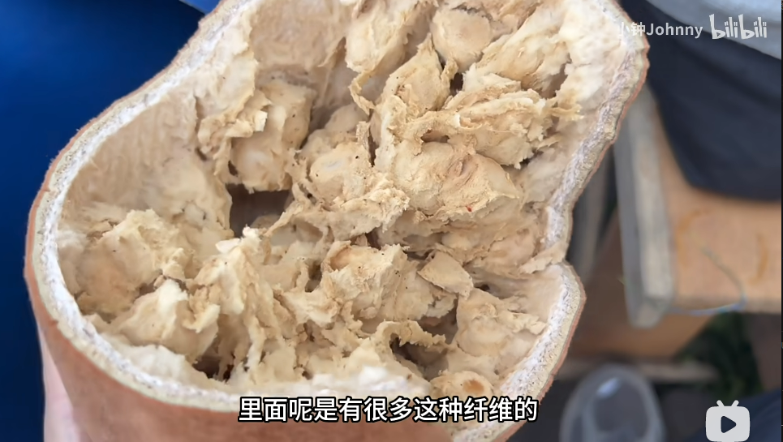

# 猴面包树

|属性|说明|
| ---- | ---- |
| 别称||
| 属||
| 分布||
| 寿命||
| 外形特征||
| 繁殖||

猴面包树成熟后的干燥果肉质地很像面包，当它果实成熟时，猴子就成群结队而来，爬上树去摘果子吃。，“猴面包树”的称呼由此而来。

参考:
- [猴面包树-百度百科](https://baike.baidu.com/item/%E7%8C%B4%E9%9D%A2%E5%8C%85%E6%A0%91/729264)