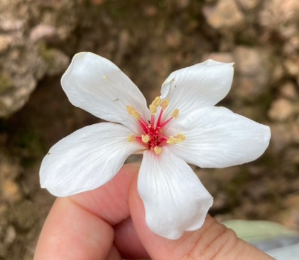
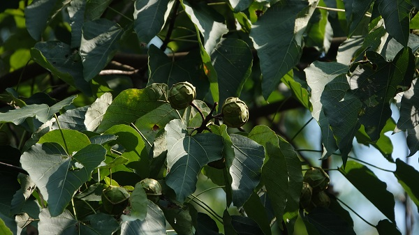

# 木油桐

|属性|说明|
| ---- | ---- |
| 别称|　千年桐|
| 属||
| 分布| 喜光，幼树耐阴。|
| 寿命||
| 外形特征||
| 繁殖||
| 毒性| 整株有毒|

【经济作用】木油桐干种仁含油率可以达到70%，经过压榨或用溶剂浸出制作得出的干性油就叫做桐油，当代社会我们已经拥有很多先进的伞面材料，用桐油涂面的油纸伞早已淡出我们的日常生活，但往上细数，桐油有1300多年广泛的使用历史，从木制家具的涂料到油纸伞的伞面，从轮船的船漆到飞机的涂层，还有军事武器的外表都需要抹上桐油，不仅防水防腐，而且耐酸耐碱。

【花】３—6月，木油桐的花闪亮登场，满山遍野的白色木油桐花点缀着绿色盎然的森林景色，被称赞为“五月雪”。木油桐花常会以两种色彩展现其绚丽多彩的美，而花色的变化过程其实是木油桐花的一种发育过程，呈现红色的是已经完成授粉过程的花，而处于黄色的是还未授粉的花朵。

参考:
- [木油桐-武夷山科普](https://wysgjgy.fujian.gov.cn/zwgk/zwkp/202305/t20230512_6168496.htm)
- [木油桐照片-柴娃娃](https://hkcww.org/hkplant/readid.php?id=689)