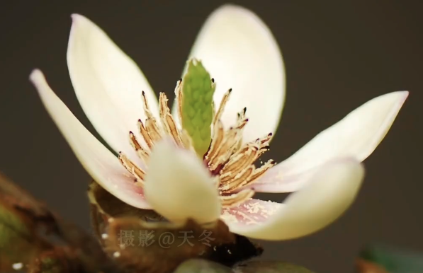
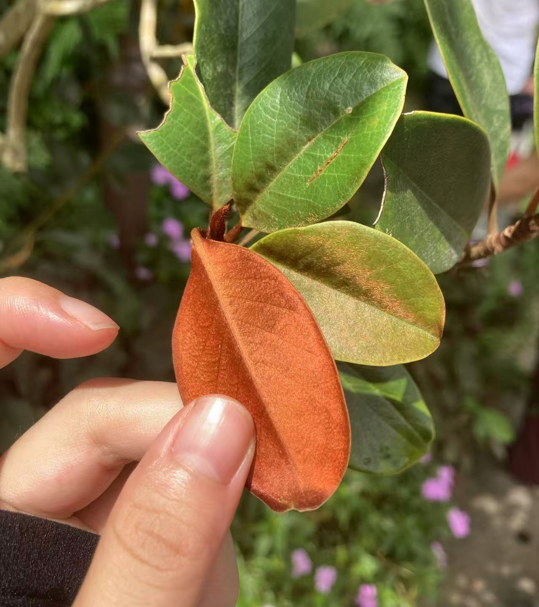

# 含笑

|属性|说明|
| ---- | ---- |
| 别称||
| 属||
| 分布||
| 寿命||
| 外形特征||
| 繁殖||
| 毒性||

【香气】含笑的花特别香，花蕾的时候，这个香味还比较适中。等到花半开的时候，这个香味就太浓了，蹿鼻子。就是所为法人半开则馥烈。花儿全开了之后，香味反而又减少了。而且含笑的气味和大部分花卉的不一样，它是明显的水果味，甜滋滋的。它的香味香味来源，所含的物质就和香蕉水，一种化学试剂是差不多的。

【广东含笑】原产于中国广东英德，常生长于海拔1250-1400米的中亚热带山地常绿落叶阔叶混交林及山顶灌丛中。阳性，喜温暖、湿润气候，耐寒。略耐旱瘠，在疏松肥沃、湿润而排水良好的酸性至微酸性（pH4.5-6.5）土壤中生长良好。

@深圳仙湖植物园，叶片背面摸起来像丝绒布料，在阳光下有熠熠生辉的尊贵金属色泽。

参考:
- [含笑花-天冬博物日志-bilibili](https://www.bilibili.com/video/BV1Mf4y167P6/?share_source=copy_web&vd_source=fcf7bbddc2ffd7f073481728ff8f0f3c)